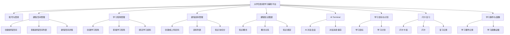
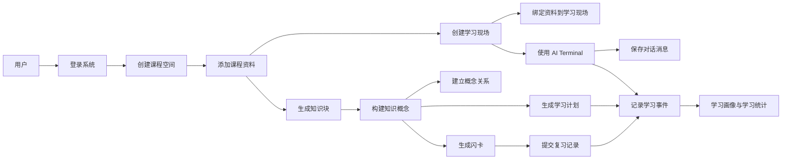

# 3. 系统需求分析

## 3.1 系统需求概述

### 3.1.1 需求概述

大学生智能学习辅助平台面向高校学生的课程学习、自主复习、项目实践和资料整理场景。系统以课程空间为基本组织单位，允许学生围绕一门课程或一个学习主题创建独立的 Workspace，在其中管理学习资料、创建学习现场、构建课程知识图谱、使用 AI Terminal 进行智能问答，并通过学习计划、闪卡复习和学习画像功能持续跟踪学习过程。

本系统的数据库设计需要支撑以下核心问题：

1. 如何保存用户账号和不同用户之间的数据归属关系。
2. 如何组织一门课程下的资料、学习任务和学习过程数据。
3. 如何保存课程资料，并支持资料被不同学习现场复用。
4. 如何将课程资料进一步抽象为知识块、知识概念和概念关系。
5. 如何保存 AI 对话、学习计划、学习事件和闪卡复习记录。
6. 如何为后续查询统计、存储过程、触发器和系统功能原型提供数据基础。

与普通资料管理系统相比，本系统的重点不只是保存文件，而是围绕学习过程建立结构化数据模型。系统需要记录学生“学什么资料、围绕什么目标学习、在哪个学习现场学习、遇到哪些知识点、产生了哪些 AI 对话和学习行为”，从而为个性化学习路径规划和学习画像提供基础。

### 3.1.2 系统角色分析

根据系统功能和使用场景，可以识别出以下主要角色。

| 角色 | 职责需求 |
| --- | --- |
| 普通学习用户 | 注册登录系统，创建课程空间，上传和管理资料，创建学习现场，使用 AI Terminal，查看知识图谱，创建学习计划，进行闪卡复习，查看学习画像 |
| 系统演示用户 | 在演示或答辩场景中展示课程空间、资料库、知识图谱、AI Terminal、学习计划和学习画像等核心功能 |
| 管理与开发人员 | 负责系统部署、数据初始化、模型服务配置、数据库维护和运行状态排查 |

本数据库实验主要围绕普通学习用户展开设计。系统演示用户和管理与开发人员在功能上不是独立业务表的核心来源，更多体现为系统使用场景和维护需求。

## 3.2 功能性需求

根据软件杯 A3 赛题要求、现有系统功能说明书和本数据库实验的裁剪范围，系统功能性需求可分为以下模块。

### 3.2.1 账号与登录需求

账号与登录模块用于保证系统数据归属和访问控制。

主要需求如下：

1. 用户可以注册账号，填写用户名、邮箱和密码。
2. 用户可以使用用户名或邮箱登录系统。
3. 系统需要保存用户基本信息和密码哈希。
4. 登录后用户才能访问课程空间、学习现场和学习资料等核心功能。
5. 系统需要保证不同用户之间的课程空间和学习数据相互隔离。

该模块对应数据库中的 `Users` 表。

### 3.2.2 课程空间管理需求

课程空间是系统的课程级容器，用于组织一门课程或一个学习主题下的全部数据。

主要需求如下：

1. 用户可以创建课程空间，填写课程名称、课程描述和专业方向。
2. 用户可以查看自己创建的课程空间列表。
3. 用户可以进入某一课程空间，查看该课程下的学习现场、资料、知识图谱、学习计划和 AI Terminal。
4. 用户可以修改课程空间信息。
5. 用户可以删除不再需要的课程空间。
6. 课程空间需要作为资料、学习现场、学习目标、知识概念、学习事件等数据的边界。

该模块对应数据库中的 `Workspaces` 表，并与 `Users` 表形成一对多关系。

### 3.2.3 学习现场管理需求

学习现场是面向具体学习任务的工作台。例如“SQL JOIN 复习”“数据库范式整理”“事务 ACID 练习”等都可以作为一个学习现场。

主要需求如下：

1. 用户可以在课程空间中创建学习现场。
2. 用户可以查看课程空间下的学习现场列表。
3. 用户可以进入某个学习现场开展具体学习任务。
4. 学习现场可以绑定课程资料。
5. 学习现场可以关联学习目标、学习计划、AI 对话和学习事件。
6. 系统需要记录学习现场标题、描述、状态、最近打开时间等信息。

该模块对应数据库中的 `Workbenches` 表。

### 3.2.4 课程资料管理需求

课程资料管理模块用于保存和组织用户上传、创建或生成的学习资料。

主要需求如下：

1. 用户可以创建或上传课程资料。
2. 资料可以分为笔记、文档、网页资料、生成内容等类型。
3. 用户可以在课程空间中查看资料列表。
4. 用户可以搜索资料、查看资料类型和更新时间。
5. 同一份资料可以被多个学习现场复用。
6. 资料可以进一步被切分为知识块，用于检索、问答和知识图谱构建。

该模块对应数据库中的 `FileObjects`、`WorkbenchResources` 和 `KnowledgeChunks` 表。

### 3.2.5 知识图谱管理需求

知识图谱模块用于表示课程中的知识点和知识点之间的关系。

主要需求如下：

1. 系统可以保存课程知识概念，例如“关系模型”“SQL 连接查询”“数据库范式”“事务 ACID”等。
2. 系统可以保存概念之间的关系，例如先修关系、相关关系和包含关系。
3. 系统可以记录知识概念与课程资料、学习现场、学习目标之间的绑定关系。
4. 用户可以查看课程空间下的知识图谱。
5. 知识图谱可以为后续薄弱点分析、学习路径规划和资源推荐提供数据基础。

该模块对应数据库中的 `KnowledgeConcepts`、`KnowledgeRelations` 和 `KnowledgeBindings` 表。

### 3.2.6 AI Terminal 与对话管理需求

AI Terminal 是课程级智能学习入口，用于支持学生通过自然语言与系统交互。

主要需求如下：

1. 用户可以在课程空间中打开 AI Terminal。
2. 用户可以向 AI 提问课程资料、知识点、学习计划等问题。
3. 系统需要保存 AI 对话会话。
4. 系统需要保存每轮用户消息和 AI 回复。
5. AI 对话可以产生学习事件，为学习画像和学习统计提供依据。
6. AI Terminal 可以结合课程资料、知识图谱和学习目标提供上下文回答。

该模块对应数据库中的 `ConversationSessions`、`ConversationMessages` 和 `LearningEvents` 表。

### 3.2.7 学习目标与学习计划需求

学习目标与学习计划模块用于将学生的学习意图转化为可执行的学习路径。

主要需求如下：

1. 用户可以创建学习目标，例如“复习 SQL 多表连接”“掌握数据库范式”等。
2. 系统可以围绕学习目标生成学习计划。
3. 学习计划可以绑定到课程空间和学习现场。
4. 学习计划需要记录目标、状态、版本和步骤内容。
5. 用户可以查看计划列表，并根据学习进展调整计划。
6. 学习计划可结合知识图谱中的先修关系进行优化。

该模块对应数据库中的 `LearningGoals` 和 `LearningPlans` 表。

### 3.2.8 闪卡复习需求

闪卡复习模块用于帮助学生对重点知识进行间隔复习。

主要需求如下：

1. 系统可以创建闪卡卡组。
2. 每个卡组下可以包含多张闪卡。
3. 闪卡需要保存正面、背面、难度、到期时间和复习次数。
4. 用户复习闪卡后，系统需要记录复习评分和下次到期时间。
5. 插入复习记录后，系统可以自动更新闪卡的复习次数和到期时间。
6. 闪卡复习行为可以记录为学习事件。

该模块对应数据库中的 `FlashcardDecks`、`Flashcards` 和 `FlashcardReviews` 表。

### 3.2.9 学习事件与学习画像需求

学习事件用于记录用户与系统交互过程中产生的关键行为，是学习画像和学习效果分析的基础。

主要需求如下：

1. 系统可以记录资料创建、学习现场打开、AI 对话、计划创建、闪卡生成、闪卡复习等事件。
2. 学习事件需要记录事件类型、发起方、关联课程空间、关联学习现场和事件内容。
3. 系统可以根据事件统计近期学习活动。
4. 学习事件可以为学习画像、记忆治理和个性化推荐提供证据。

该模块对应数据库中的 `LearningEvents` 表。

## 3.3 非功能性需求

结合软件杯赛题要求和系统实际使用场景，本系统非功能性需求如下：

1. 可用性需求：系统界面应简洁清晰，操作入口明确，用户能够快速完成登录、课程空间切换、资料查看、学习现场进入和 AI 对话等操作。
2. 数据安全需求：系统应通过用户身份认证和课程空间所有权校验保证数据隔离，防止用户访问他人的课程资料和学习记录。
3. 数据完整性需求：数据库应设置主键、外键、唯一约束和检查约束，保证用户、课程空间、资料、学习现场、知识概念和复习记录之间的关系正确。
4. 可维护性需求：系统功能模块应边界清晰，数据库表设计应命名规范，便于后期维护、扩展和调试。
5. 可扩展性需求：系统后续可能继续扩展多模态资源生成、音视频分析、学习效果评估和更复杂的学习画像，因此数据库设计需要预留扩展空间。
6. 响应效率需求：课程空间列表、资料列表、知识图谱查询、AI 对话历史和闪卡到期查询应在合理时间内返回结果。
7. 内容安全需求：AI 生成内容和学习建议应尽量避免错误信息和不合适内容，必要时记录来源资料和学习事件，便于追溯。
8. 浏览器兼容需求：系统前端应能够在主流浏览器中正常访问，适合学生在日常学习环境中使用。

## 3.4 总体功能结构

根据上述需求，系统总体功能可以划分为九个核心模块：

该功能结构图体现了系统从用户登录，到课程空间管理，再到学习资料、学习现场、知识图谱、AI 对话、学习计划和学习事件分析的整体业务流程。

## 3.5 用例捕获

### 3.5.1 用例模型说明

用例模型用于描述系统为用户提供了哪些功能。通过需求分析，本系统的主要参与者为普通学习用户，系统演示用户和管理与开发人员作为辅助角色存在。

### 3.5.2 系统核心用例

| 用例编号 | 用例名称 | 参与者 | 用例说明 |
| --- | --- | --- | --- |
| UC01 | 用户登录 | 普通学习用户 | 用户输入用户名或邮箱和密码，系统验证身份并进入课程空间 |
| UC02 | 创建课程空间 | 普通学习用户 | 用户创建一门课程或学习主题，填写名称、描述和专业方向 |
| UC03 | 管理课程资料 | 普通学习用户 | 用户创建、上传、查看和搜索课程资料 |
| UC04 | 创建学习现场 | 普通学习用户 | 用户围绕具体学习任务创建 Workbench |
| UC05 | 绑定学习资料 | 普通学习用户 | 用户将课程资料加入某个学习现场 |
| UC06 | 查看知识图谱 | 普通学习用户 | 用户查看课程知识概念和概念关系 |
| UC07 | 使用 AI Terminal | 普通学习用户 | 用户通过自然语言进行课程问答和学习规划 |
| UC08 | 创建学习计划 | 普通学习用户 | 用户围绕学习目标创建或查看学习计划 |
| UC09 | 闪卡复习 | 普通学习用户 | 用户查看到期闪卡并提交复习评分 |
| UC10 | 查看学习画像 | 普通学习用户 | 用户查看学习事件、画像信号和记忆治理信息 |

## 3.6 主要用例事件流

### 3.6.1 用户登录用例

用例名称：用户登录

用例描述：用户输入用户名或邮箱和密码，系统验证身份后进入课程空间页面。

参与者：普通学习用户

前置条件：用户已经注册账号。

基本路径：

1. 用户进入系统登录页面。
2. 用户输入邮箱或用户名。
3. 用户输入密码。
4. 用户点击登录按钮。
5. 系统验证账号和密码。
6. 验证成功后，系统创建会话并跳转到课程空间页面。

异常事件流：

1. 如果账号不存在或密码错误，系统提示登录失败。
2. 如果用户未登录直接访问课程空间或学习现场，系统跳转回登录页面。

### 3.6.2 创建课程空间用例

用例名称：创建课程空间

用例描述：用户创建一个新的课程空间，用于管理一门课程或一个学习主题。

参与者：普通学习用户

前置条件：用户已经登录系统。

基本路径：

1. 用户进入课程空间页面。
2. 用户点击新建课程空间。
3. 用户填写课程名称、课程描述和专业方向。
4. 用户提交创建请求。
5. 系统将课程空间数据保存到数据库。
6. 系统刷新课程空间列表，并显示新创建的课程空间。

异常事件流：

1. 如果课程名称为空，系统提示用户补充课程名称。
2. 如果保存失败，系统提示创建失败并允许用户重新提交。

### 3.6.3 学习现场绑定资料用例

用例名称：学习现场绑定资料

用例描述：用户进入学习现场后，将课程资料加入当前学习任务。

参与者：普通学习用户

前置条件：用户已经登录，课程空间中已经存在学习现场和课程资料。

基本路径：

1. 用户进入某个学习现场。
2. 用户点击添加资料或打开资料入口。
3. 系统显示当前课程空间可用资料列表。
4. 用户选择需要加入学习现场的资料。
5. 系统在学习现场资源绑定表中保存绑定关系。
6. 用户可以在学习现场中打开该资料进行学习。

异常事件流：

1. 如果资料不存在，系统提示资料加载失败。
2. 如果资料和学习现场不属于同一课程空间，系统拒绝绑定。

### 3.6.4 AI Terminal 对话用例

用例名称：AI Terminal 对话

用例描述：用户在课程空间中向 AI Terminal 提问，系统结合课程上下文生成回答并保存对话记录。

参与者：普通学习用户

前置条件：用户已经登录并进入课程空间。

基本路径：

1. 用户打开 AI Terminal。
2. 用户输入学习问题或学习目标。
3. 系统读取课程空间、学习资料和知识上下文。
4. AI 生成回答或行动建议。
5. 系统保存对话会话和消息内容。
6. 系统根据需要记录学习事件。

异常事件流：

1. 如果 AI 服务不可用，系统提示请求失败。
2. 如果用户输入为空，系统不提交请求并提示用户输入内容。

### 3.6.5 闪卡复习用例

用例名称：闪卡复习

用例描述：用户查看到期闪卡，完成复习后提交评分，系统更新闪卡状态并记录学习事件。

参与者：普通学习用户

前置条件：课程空间中已经存在闪卡卡组和闪卡。

基本路径：

1. 用户进入闪卡复习入口。
2. 系统查询当前到期的闪卡。
3. 用户查看卡片正面并回忆答案。
4. 用户查看背面解释。
5. 用户提交 again、hard、good 或 easy 评分。
6. 系统保存复习记录。
7. 系统更新闪卡复习次数和下次到期时间。
8. 系统记录一条闪卡复习学习事件。

异常事件流：

1. 如果没有到期闪卡，系统提示暂无需要复习的卡片。
2. 如果评分值不合法，系统拒绝提交复习记录。

## 3.7 数据流程说明

系统核心数据流程如下：

数据流程说明：

1. 用户登录后创建课程空间，课程空间作为后续所有学习数据的归属边界。
2. 用户在课程空间中添加课程资料，资料保存后可以被学习现场引用。
3. 课程资料可被切分为知识块，并进一步抽取为知识概念。
4. 知识概念之间建立关系后形成课程知识图谱。
5. 用户在学习现场和 AI Terminal 中产生对话、计划和复习行为。
6. 系统将关键行为保存为学习事件，用于学习画像和学习效果分析。

## 3.8 本章小结

本章结合软件杯比赛项目背景和大学生智能学习辅助平台的实际功能，对系统需求进行了分析。首先说明了系统面向高校学生课程学习、资料管理、知识图谱和个性化学习规划的总体需求；随后从账号登录、课程空间、学习现场、课程资料、知识图谱、AI Terminal、学习计划、闪卡复习和学习事件等方面分析了功能性需求；最后给出了非功能性需求、总体功能结构、核心用例和数据流程说明。

通过本章分析可以看出，本系统的数据库设计需要支持多类业务对象及其复杂关系，为后续 ER 模型设计、关系模式转换、SQL Server 建表语句、查询语句、存储过程和触发器设计提供了基础。

