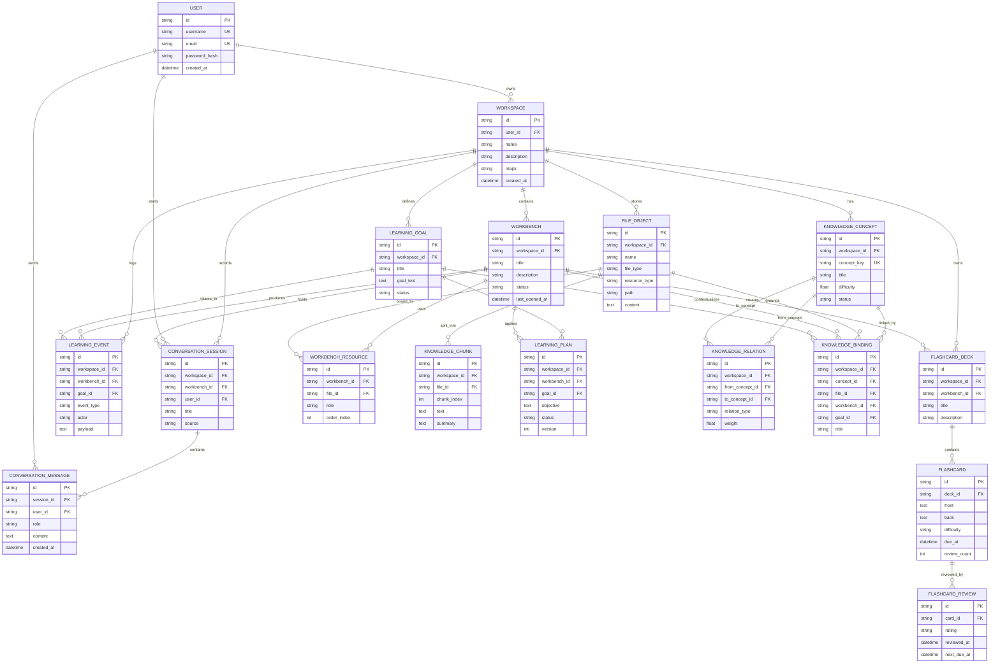

# 大学生智能学习辅助平台数据库核心模型草案

本文先对现有系统进行课程作业规模的裁剪，保留数据库设计中最容易说明、最能体现业务价值的核心对象。正式作业可将题目命名为“大学生智能学习辅助平台数据库设计”或“网络辅助教学平台数据库设计：大学生 AI 学习工作空间”。

## 1. 裁剪原则

现有项目的数据库模型较完整，包含索引任务、学习画像治理、运行轨迹、记忆候选、资源生成审查等大量工程化表。课程作业不建议全部纳入，否则 ER 图和建表 SQL 会过于庞大。

本草案保留以下主线：

1. 用户创建课程空间。
2. 课程空间下管理学习资料和学习现场。
3. 学习现场承载具体学习任务、学习目标和计划。
4. 课程资料被抽取为知识块，并进一步形成知识概念与概念关系。
5. 用户通过 AI 对话、学习事件、闪卡复习等行为形成学习记录。

## 2. 核心实体清单

| 序号 | 实体名 | 中文名称 | 主要作用 | 关键字段建议 |
| --- | --- | --- | --- | --- |
| E01 | `User` | 用户 | 保存平台账号信息，是课程空间、对话、学习记忆等数据的拥有者 | `id`、`username`、`email`、`password_hash`、`created_at` |
| E02 | `Workspace` | 课程空间 | 表示一门课程或一个学习主题，是系统主要数据边界 | `id`、`user_id`、`name`、`description`、`major`、`created_at` |
| E03 | `Workbench` | 学习现场 | 表示一个具体学习任务，如“SQL JOIN 复习” | `id`、`workspace_id`、`title`、`description`、`status`、`last_opened_at` |
| E04 | `FileObject` | 学习资料 | 保存上传文件、网页资料、笔记、AI 生成资料等 | `id`、`workspace_id`、`name`、`file_type`、`resource_type`、`path`、`content` |
| E05 | `WorkbenchResource` | 学习现场资源绑定 | 表示某个资料被加入某个学习现场 | `id`、`workbench_id`、`file_id`、`role`、`order_index` |
| E06 | `LearningGoal` | 学习目标 | 记录用户在课程空间中的学习目标、技能和薄弱点 | `id`、`workspace_id`、`title`、`goal_text`、`status` |
| E07 | `LearningPlan` | 学习计划 | 保存围绕目标生成的阶段计划和任务步骤 | `id`、`workspace_id`、`workbench_id`、`goal_id`、`objective`、`status`、`version` |
| E08 | `KnowledgeChunk` | 知识块 | 保存从资料中切分出的可检索文本片段 | `id`、`workspace_id`、`file_id`、`chunk_index`、`text`、`summary` |
| E09 | `KnowledgeConcept` | 知识概念 | 表示课程中的知识点，如“连接查询”“范式”“事务” | `id`、`workspace_id`、`concept_key`、`title`、`difficulty`、`status` |
| E10 | `KnowledgeRelation` | 概念关系 | 表示知识概念之间的先修、包含、相关等关系 | `id`、`workspace_id`、`from_concept_id`、`to_concept_id`、`relation_type`、`weight` |
| E11 | `KnowledgeBinding` | 知识绑定 | 表示知识概念与资料、学习现场或学习目标之间的关联 | `id`、`workspace_id`、`concept_id`、`file_id`、`workbench_id`、`goal_id`、`role` |
| E12 | `ConversationSession` | AI 对话会话 | 保存用户在课程或学习现场中的 AI 对话主题 | `id`、`workspace_id`、`workbench_id`、`user_id`、`title`、`source` |
| E13 | `ConversationMessage` | AI 对话消息 | 保存每一轮用户与 AI 的消息内容 | `id`、`session_id`、`user_id`、`role`、`content`、`created_at` |
| E14 | `LearningEvent` | 学习事件 | 记录计划创建、资料索引、测验完成、复习反馈等学习行为 | `id`、`workspace_id`、`workbench_id`、`goal_id`、`event_type`、`actor`、`payload` |
| E15 | `FlashcardDeck` | 闪卡卡组 | 保存由资料或 AI Studio 生成的复习卡组 | `id`、`workspace_id`、`workbench_id`、`title`、`description` |
| E16 | `Flashcard` | 闪卡 | 保存单张复习卡片及其复习状态 | `id`、`deck_id`、`front`、`back`、`difficulty`、`due_at`、`review_count` |
| E17 | `FlashcardReview` | 闪卡复习记录 | 保存用户每次复习闪卡的评分和下次到期时间 | `id`、`card_id`、`rating`、`reviewed_at`、`next_due_at` |

## 3. 建议保留与暂缓的模块

建议保留在正式作业中的模块：

| 模块 | 涉及实体 | 保留理由 |
| --- | --- | --- |
| 账号与课程空间 | `User`、`Workspace` | 是系统最基础的数据归属关系 |
| 学习现场与资料管理 | `Workbench`、`FileObject`、`WorkbenchResource` | 体现平台作为学习工作台的核心功能 |
| 学习目标与计划 | `LearningGoal`、`LearningPlan` | 体现个性化学习规划能力 |
| 知识图谱 | `KnowledgeChunk`、`KnowledgeConcept`、`KnowledgeRelation`、`KnowledgeBinding` | 是数据库设计最有特色的部分，适合画 ER 图 |
| AI 对话与学习事件 | `ConversationSession`、`ConversationMessage`、`LearningEvent` | 支撑查询、统计和触发器设计 |
| 闪卡复习 | `FlashcardDeck`、`Flashcard`、`FlashcardReview` | 可作为原型功能和测试数据展示 |

暂缓纳入正式作业的模块：

| 模块 | 暂缓原因 |
| --- | --- |
| 认证令牌、登录限流 | 更偏安全工程实现，和数据库设计主线关系较弱 |
| 画像候选、记忆治理、状态快照 | 表较多，适合真实项目，不适合作业规模 |
| AI Studio 生成物审查与运行轨迹 | 字段复杂，很多 JSON 字段不利于课程作业展示 |
| 索引任务、向量库配置 | 属于检索工程实现，ER 图中可用“知识块”概括 |

## 4. 实体关系说明

| 关系 | 类型 | 说明 |
| --- | --- | --- |
| `User` - `Workspace` | 一对多 | 一个用户可以创建多个课程空间，一个课程空间属于一个用户 |
| `Workspace` - `Workbench` | 一对多 | 一个课程空间可以包含多个学习现场 |
| `Workspace` - `FileObject` | 一对多 | 一个课程空间可以包含多个学习资料 |
| `Workbench` - `FileObject` | 多对多 | 通过 `WorkbenchResource` 关联，一个学习现场可绑定多个资料，一个资料也可用于多个学习现场 |
| `Workspace` - `LearningGoal` | 一对多 | 一个课程空间可有多个学习目标 |
| `LearningGoal` - `LearningPlan` | 一对多 | 一个学习目标可生成多个计划版本 |
| `Workbench` - `LearningPlan` | 一对多 | 一个学习现场可关联多个学习计划 |
| `FileObject` - `KnowledgeChunk` | 一对多 | 一个资料可切分为多个知识块 |
| `Workspace` - `KnowledgeConcept` | 一对多 | 一个课程空间拥有自己的课程知识点集合 |
| `KnowledgeConcept` - `KnowledgeConcept` | 多对多自关联 | 通过 `KnowledgeRelation` 表示先修、包含、相关等概念关系 |
| `KnowledgeConcept` - `FileObject` / `Workbench` / `LearningGoal` | 多对多 | 通过 `KnowledgeBinding` 绑定概念与资料、学习现场或目标 |
| `Workspace` - `ConversationSession` | 一对多 | 一个课程空间可保存多个 AI 对话会话 |
| `ConversationSession` - `ConversationMessage` | 一对多 | 一个会话包含多条用户或 AI 消息 |
| `Workspace` - `LearningEvent` | 一对多 | 一个课程空间记录多条学习事件 |
| `FlashcardDeck` - `Flashcard` | 一对多 | 一个卡组包含多张闪卡 |
| `Flashcard` - `FlashcardReview` | 一对多 | 一张闪卡可产生多次复习记录 |

## 5. ER 图

## 6. 后续可扩展方向

正式数据库设计文档中，可以在本草案基础上继续补充：

1. 需求分析：按账号管理、课程空间管理、资料管理、知识图谱、学习计划、AI 对话、闪卡复习等模块展开。
2. 关系模式：将 ER 图中的实体转成关系表，并标注主键、外键、唯一约束和检查约束。
3. 建表 SQL：建议使用 MySQL 8.0 语法，便于写存储过程和触发器。
4. 查询示例：课程资料查询、某课程知识图谱查询、某用户学习计划查询、闪卡到期查询、学习事件统计。
5. 存储过程：例如“按用户和课程统计学习概况”的带参数存储过程。
6. 触发器：例如“插入闪卡复习记录后自动更新闪卡复习次数和下次到期时间”。
