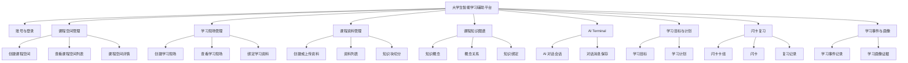
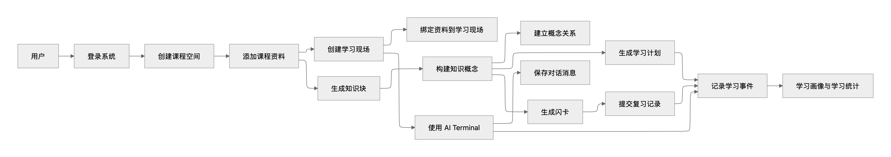
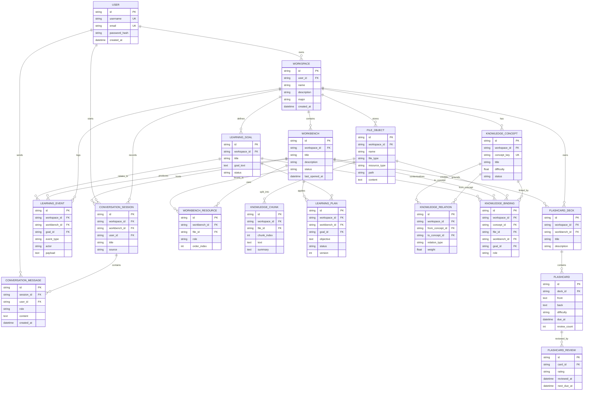

# 大学生智能学习辅助平台数据库设计文档

| 项目 | 内容 |
| --- | --- |
| 课程名称 | 高级数据库系统设计课程实践 |
| 实验名称 | 实践综合实验五：数据库设计 |
| 课题名称 | 大学生智能学习辅助平台数据库设计 |
| 题目类型 | 自拟题目 |
| 项目背景 | 第十五届中国软件杯 A 组赛题 A3：基于大模型的个性化资源生成与学习多智能体系统开发 |
| 数据库类型 | SQL Server |
| 学生姓名 | 朱业鑫 |
| 学号 | 2412411001 |
| 班级 | 2024级软件工程3班 |
| 完成日期 | 2026 年 6 月 |

## 摘要

本文档围绕“大学生智能学习辅助平台”完成数据库设计。课题基于软件杯比赛项目背景，从完整的多智能学习系统中裁剪出适合课程作业规模的核心业务，包括用户账号、课程空间、学习现场、课程资料、知识图谱、AI 对话、学习目标与计划、闪卡复习和学习事件等模块。按照数据库设计实验要求，完成了课题背景、系统需求分析、ER 模型及说明、关系模式转换、SQL Server 表结构与建表语句、数据查询语句、存储过程、触发器和系统功能截图说明。

## 目录

1. 封面与摘要
2. 课题背景
3. 系统需求分析
4. ER 模型及说明
5. CDM/PDM 图与关系模式转换说明
6. 表结构列表及其建表语句
7. 数据查询功能语句及说明
8. 存储过程代码及说明
9. 触发器代码及说明
10. 系统功能说明（界面截图及说明）

## 说明

本数据库设计作业的课题来源于第十五届中国软件杯 A 组赛题“A3-基于大模型的个性化资源生成与学习多智能体系统开发”。该赛题面向真实的软件系统开发场景，整体业务范围较大，涉及用户账号、课程空间、学习资料、学习现场、知识图谱、AI 对话、学习计划、闪卡复习、学习事件等多个模块，其数据库设计复杂度明显高于一般课程作业中的基础系统。为了使这个项目能够适配这次数据库课程实践要求，本文对原项目进行了裁剪和整理，仅保留适合课程作业规模的核心数据模型。由于部分 SQL Server 建表语句、查询语句、存储过程和触发器代码较为复杂，正文中相关代码在本人理解业务需求和数据库结构的基础上，借助大模型进行了辅助生成、格式整理和修改完善。最终文档内容经过人工筛选、调整和整合，展示了本课题的数据库设计思路与实现过程。

---

# 2. 课题背景

## 2.1 课题来源

本数据库设计实验选题为“大学生智能学习辅助平台数据库设计”，课题来源于软件杯比赛项目。比赛项目对应第十五届中国软件杯 A 组赛题“A3-基于大模型的个性化资源生成与学习多智能体系统开发”。赛题面向高等教育个性化学习场景，要求参赛团队围绕新时代大学生的学习需求和学习痛点，结合大模型、多智能体协同、多模态资源生成等技术，构建能够支持个性化学习画像、学习资源生成、学习路径规划和智能辅导的学习智能体系统。

本课题从该比赛项目中抽取“数据组织与数据库设计”部分作为数据库课程实践内容。由于比赛项目本身涉及用户账号、课程空间、学习资料、学习现场、知识图谱、AI 对话、学习计划、闪卡复习和学习事件等多类数据对象，具有较完整的数据库设计场景，因此适合作为数据库设计实验中的自拟题目。

## 2.2 高等教育个性化学习背景

随着数字化教育和人工智能技术的发展，高校学生的学习方式正在从传统课堂听讲逐渐转向“课堂学习 + 在线资料 + 自主探索 + AI 辅助”的混合学习模式。大学生在学习专业课程时，通常需要同时面对教材、课件、实验文档、课程作业、项目代码、论文资料、网络资源和 AI 生成内容。学习资料数量不断增加，资料类型也越来越复杂。

在这种背景下，学生学习过程面临以下问题：

1. 学习资料分散。课程资料可能分布在本地文件、网盘、课程平台、聊天记录和网页中，学生难以形成统一的资料库。
2. 学习目标不清晰。学生在复习考试、完成项目或阅读文献时，经常只有模糊目标，缺少阶段化、可执行的学习计划。
3. 知识结构不直观。课程知识点之间存在先修、包含、相关等关系，但传统资料通常以线性文档形式呈现，不利于学生理解知识网络。
4. 个体差异明显。不同学生在知识基础、学习进度、薄弱点、学习偏好和认知风格方面存在差异，统一的学习资源难以满足个性化需求。
5. 学习过程缺少记录。学生的资料阅读、AI 对话、练习反馈、闪卡复习和学习计划执行情况如果没有被系统记录，就难以形成持续的学习画像和学习反馈。

因此，有必要设计一个面向大学生的智能学习辅助平台，通过数据库系统对学习资料、学习任务、知识结构和学习行为进行统一管理，为后续的智能推荐、学习规划和学习效果分析提供数据基础。

## 2.3 大模型与多智能体学习系统背景

近年来，大模型技术快速发展，具备较强的自然语言理解、内容生成、知识推理和多模态处理能力。在教育场景中，大模型可以用于课程资料总结、题目生成、学习计划制定、知识点解释、代码辅助、文档改写和个性化反馈。与此同时，多智能体协同思想可以将复杂学习任务拆分为不同角色，例如上下文收集智能体、学习状态分析智能体、资源生成智能体、计划制定智能体和审查智能体，使系统能够完成更复杂的学习辅助流程。

软件杯 A3 赛题正是基于这一背景提出：系统需要围绕高等教育学习场景，支持对话式学习画像构建、多智能体协同资源生成、个性化学习路径规划、智能辅导和学习效果评估等功能。为了支撑这些功能，系统不仅需要前端界面和智能体逻辑，更需要一个结构合理、关系清晰、可扩展的数据模型。

例如：

1. 对话式学习画像需要保存用户、对话消息、学习事件和画像证据。
2. 个性化资源生成需要保存课程资料、生成资源、来源引用和学习目标。
3. 学习路径规划需要保存学习目标、学习计划、计划版本和执行状态。
4. 知识图谱分析需要保存知识概念、概念关系、资料与概念的绑定关系。
5. 闪卡复习和学习评估需要保存卡组、卡片、复习记录和学习事件。

由此可见，数据库设计是整个智能学习系统的基础部分。数据库表结构是否清晰，直接影响系统能否可靠地保存学习过程数据、支撑查询统计、实现个性化分析并扩展后续功能。

## 2.4 本课题研究意义

本课题以“大学生智能学习辅助平台”为对象，围绕数据库课程实验要求，完成需求分析、ER 模型设计、关系模式转换、表结构设计、SQL Server 建表语句、查询语句、存储过程、触发器和系统功能说明等内容。

本课题的意义主要体现在以下几个方面：

1. 从实际比赛项目中抽取数据库设计问题，使数据库课程实验不再停留在简单示例系统，而是与真实软件开发场景相结合。
2. 面向大学生学习过程设计数据模型，能够覆盖用户、课程、资料、任务、知识图谱、对话、计划和复习记录等多类业务数据。
3. 通过知识概念、概念关系和知识绑定等表设计，体现智能学习系统区别于普通资料管理系统的特点。
4. 通过学习事件、AI 对话和闪卡复习等数据设计，为后续学习画像、学习效果评估和个性化推荐提供基础。
5. 通过 SQL Server 建表、查询、存储过程和触发器设计，将概念模型落实为可执行的数据库实现方案。

综上，本课题既符合数据库设计实验中“自拟题目”的要求，也与软件杯比赛项目背景相结合，能够较完整地体现数据库设计在智能学习平台开发中的作用。


---


# 3. 系统需求分析

## 3.1 系统需求概述

### 3.1.1 需求概述

大学生智能学习辅助平台面向高校学生的课程学习、自主复习、项目实践和资料整理场景。系统以课程空间为基本组织单位，允许学生围绕一门课程或一个学习主题创建独立的 Workspace，在其中管理学习资料、创建学习现场、构建课程知识图谱、使用 AI Terminal 进行智能问答，并通过学习计划、闪卡复习和学习画像功能持续跟踪学习过程。

本系统的数据库设计需要支撑以下核心问题：

1. 如何保存用户账号和不同用户之间的数据归属关系。
2. 如何组织一门课程下的资料、学习任务和学习过程数据。
3. 如何保存课程资料，并支持资料被不同学习现场复用。
4. 如何将课程资料进一步抽象为知识块、知识概念和概念关系。
5. 如何保存 AI 对话、学习计划、学习事件和闪卡复习记录。
6. 如何为后续查询统计、存储过程、触发器和系统功能原型提供数据基础。

与普通资料管理系统相比，本系统的重点不只是保存文件，而是围绕学习过程建立结构化数据模型。系统需要记录学生“学什么资料、围绕什么目标学习、在哪个学习现场学习、遇到哪些知识点、产生了哪些 AI 对话和学习行为”，从而为个性化学习路径规划和学习画像提供基础。

### 3.1.2 系统角色分析

根据系统功能和使用场景，可以识别出以下主要角色。

| 角色 | 职责需求 |
| --- | --- |
| 普通学习用户 | 注册登录系统，创建课程空间，上传和管理资料，创建学习现场，使用 AI Terminal，查看知识图谱，创建学习计划，进行闪卡复习，查看学习画像 |
| 系统演示用户 | 在演示或答辩场景中展示课程空间、资料库、知识图谱、AI Terminal、学习计划和学习画像等核心功能 |
| 管理与开发人员 | 负责系统部署、数据初始化、模型服务配置、数据库维护和运行状态排查 |

本数据库实验主要围绕普通学习用户展开设计。系统演示用户和管理与开发人员在功能上不是独立业务表的核心来源，更多体现为系统使用场景和维护需求。

## 3.2 功能性需求

根据软件杯 A3 赛题要求、现有系统功能说明书和本数据库实验的裁剪范围，系统功能性需求可分为以下模块。

### 3.2.1 账号与登录需求

账号与登录模块用于保证系统数据归属和访问控制。

主要需求如下：

1. 用户可以注册账号，填写用户名、邮箱和密码。
2. 用户可以使用用户名或邮箱登录系统。
3. 系统需要保存用户基本信息和密码哈希。
4. 登录后用户才能访问课程空间、学习现场和学习资料等核心功能。
5. 系统需要保证不同用户之间的课程空间和学习数据相互隔离。

该模块对应数据库中的 `Users` 表。

### 3.2.2 课程空间管理需求

课程空间是系统的课程级容器，用于组织一门课程或一个学习主题下的全部数据。

主要需求如下：

1. 用户可以创建课程空间，填写课程名称、课程描述和专业方向。
2. 用户可以查看自己创建的课程空间列表。
3. 用户可以进入某一课程空间，查看该课程下的学习现场、资料、知识图谱、学习计划和 AI Terminal。
4. 用户可以修改课程空间信息。
5. 用户可以删除不再需要的课程空间。
6. 课程空间需要作为资料、学习现场、学习目标、知识概念、学习事件等数据的边界。

该模块对应数据库中的 `Workspaces` 表，并与 `Users` 表形成一对多关系。

### 3.2.3 学习现场管理需求

学习现场是面向具体学习任务的工作台。例如“SQL JOIN 复习”“数据库范式整理”“事务 ACID 练习”等都可以作为一个学习现场。

主要需求如下：

1. 用户可以在课程空间中创建学习现场。
2. 用户可以查看课程空间下的学习现场列表。
3. 用户可以进入某个学习现场开展具体学习任务。
4. 学习现场可以绑定课程资料。
5. 学习现场可以关联学习目标、学习计划、AI 对话和学习事件。
6. 系统需要记录学习现场标题、描述、状态、最近打开时间等信息。

该模块对应数据库中的 `Workbenches` 表。

### 3.2.4 课程资料管理需求

课程资料管理模块用于保存和组织用户上传、创建或生成的学习资料。

主要需求如下：

1. 用户可以创建或上传课程资料。
2. 资料可以分为笔记、文档、网页资料、生成内容等类型。
3. 用户可以在课程空间中查看资料列表。
4. 用户可以搜索资料、查看资料类型和更新时间。
5. 同一份资料可以被多个学习现场复用。
6. 资料可以进一步被切分为知识块，用于检索、问答和知识图谱构建。

该模块对应数据库中的 `FileObjects`、`WorkbenchResources` 和 `KnowledgeChunks` 表。

### 3.2.5 知识图谱管理需求

知识图谱模块用于表示课程中的知识点和知识点之间的关系。

主要需求如下：

1. 系统可以保存课程知识概念，例如“关系模型”“SQL 连接查询”“数据库范式”“事务 ACID”等。
2. 系统可以保存概念之间的关系，例如先修关系、相关关系和包含关系。
3. 系统可以记录知识概念与课程资料、学习现场、学习目标之间的绑定关系。
4. 用户可以查看课程空间下的知识图谱。
5. 知识图谱可以为后续薄弱点分析、学习路径规划和资源推荐提供数据基础。

该模块对应数据库中的 `KnowledgeConcepts`、`KnowledgeRelations` 和 `KnowledgeBindings` 表。

### 3.2.6 AI Terminal 与对话管理需求

AI Terminal 是课程级智能学习入口，用于支持学生通过自然语言与系统交互。

主要需求如下：

1. 用户可以在课程空间中打开 AI Terminal。
2. 用户可以向 AI 提问课程资料、知识点、学习计划等问题。
3. 系统需要保存 AI 对话会话。
4. 系统需要保存每轮用户消息和 AI 回复。
5. AI 对话可以产生学习事件，为学习画像和学习统计提供依据。
6. AI Terminal 可以结合课程资料、知识图谱和学习目标提供上下文回答。

该模块对应数据库中的 `ConversationSessions`、`ConversationMessages` 和 `LearningEvents` 表。

### 3.2.7 学习目标与学习计划需求

学习目标与学习计划模块用于将学生的学习意图转化为可执行的学习路径。

主要需求如下：

1. 用户可以创建学习目标，例如“复习 SQL 多表连接”“掌握数据库范式”等。
2. 系统可以围绕学习目标生成学习计划。
3. 学习计划可以绑定到课程空间和学习现场。
4. 学习计划需要记录目标、状态、版本和步骤内容。
5. 用户可以查看计划列表，并根据学习进展调整计划。
6. 学习计划可结合知识图谱中的先修关系进行优化。

该模块对应数据库中的 `LearningGoals` 和 `LearningPlans` 表。

### 3.2.8 闪卡复习需求

闪卡复习模块用于帮助学生对重点知识进行间隔复习。

主要需求如下：

1. 系统可以创建闪卡卡组。
2. 每个卡组下可以包含多张闪卡。
3. 闪卡需要保存正面、背面、难度、到期时间和复习次数。
4. 用户复习闪卡后，系统需要记录复习评分和下次到期时间。
5. 插入复习记录后，系统可以自动更新闪卡的复习次数和到期时间。
6. 闪卡复习行为可以记录为学习事件。

该模块对应数据库中的 `FlashcardDecks`、`Flashcards` 和 `FlashcardReviews` 表。

### 3.2.9 学习事件与学习画像需求

学习事件用于记录用户与系统交互过程中产生的关键行为，是学习画像和学习效果分析的基础。

主要需求如下：

1. 系统可以记录资料创建、学习现场打开、AI 对话、计划创建、闪卡生成、闪卡复习等事件。
2. 学习事件需要记录事件类型、发起方、关联课程空间、关联学习现场和事件内容。
3. 系统可以根据事件统计近期学习活动。
4. 学习事件可以为学习画像、记忆治理和个性化推荐提供证据。

该模块对应数据库中的 `LearningEvents` 表。

## 3.3 非功能性需求

结合软件杯赛题要求和系统实际使用场景，本系统非功能性需求如下：

1. 可用性需求：系统界面应简洁清晰，操作入口明确，用户能够快速完成登录、课程空间切换、资料查看、学习现场进入和 AI 对话等操作。
2. 数据安全需求：系统应通过用户身份认证和课程空间所有权校验保证数据隔离，防止用户访问他人的课程资料和学习记录。
3. 数据完整性需求：数据库应设置主键、外键、唯一约束和检查约束，保证用户、课程空间、资料、学习现场、知识概念和复习记录之间的关系正确。
4. 可维护性需求：系统功能模块应边界清晰，数据库表设计应命名规范，便于后期维护、扩展和调试。
5. 可扩展性需求：系统后续可能继续扩展多模态资源生成、音视频分析、学习效果评估和更复杂的学习画像，因此数据库设计需要预留扩展空间。
6. 响应效率需求：课程空间列表、资料列表、知识图谱查询、AI 对话历史和闪卡到期查询应在合理时间内返回结果。
7. 内容安全需求：AI 生成内容和学习建议应尽量避免错误信息和不合适内容，必要时记录来源资料和学习事件，便于追溯。
8. 浏览器兼容需求：系统前端应能够在主流浏览器中正常访问，适合学生在日常学习环境中使用。

## 3.4 总体功能结构

根据上述需求，系统总体功能可以划分为九个核心模块：



该功能结构图体现了系统从用户登录，到课程空间管理，再到学习资料、学习现场、知识图谱、AI 对话、学习计划和学习事件分析的整体业务流程。

## 3.5 用例捕获

### 3.5.1 用例模型说明

用例模型用于描述系统为用户提供了哪些功能。通过需求分析，本系统的主要参与者为普通学习用户，系统演示用户和管理与开发人员作为辅助角色存在。

### 3.5.2 系统核心用例

| 用例编号 | 用例名称 | 参与者 | 用例说明 |
| --- | --- | --- | --- |
| UC01 | 用户登录 | 普通学习用户 | 用户输入用户名或邮箱和密码，系统验证身份并进入课程空间 |
| UC02 | 创建课程空间 | 普通学习用户 | 用户创建一门课程或学习主题，填写名称、描述和专业方向 |
| UC03 | 管理课程资料 | 普通学习用户 | 用户创建、上传、查看和搜索课程资料 |
| UC04 | 创建学习现场 | 普通学习用户 | 用户围绕具体学习任务创建 Workbench |
| UC05 | 绑定学习资料 | 普通学习用户 | 用户将课程资料加入某个学习现场 |
| UC06 | 查看知识图谱 | 普通学习用户 | 用户查看课程知识概念和概念关系 |
| UC07 | 使用 AI Terminal | 普通学习用户 | 用户通过自然语言进行课程问答和学习规划 |
| UC08 | 创建学习计划 | 普通学习用户 | 用户围绕学习目标创建或查看学习计划 |
| UC09 | 闪卡复习 | 普通学习用户 | 用户查看到期闪卡并提交复习评分 |
| UC10 | 查看学习画像 | 普通学习用户 | 用户查看学习事件、画像信号和记忆治理信息 |

## 3.6 主要用例事件流

### 3.6.1 用户登录用例

用例名称：用户登录

用例描述：用户输入用户名或邮箱和密码，系统验证身份后进入课程空间页面。

参与者：普通学习用户

前置条件：用户已经注册账号。

基本路径：

1. 用户进入系统登录页面。
2. 用户输入邮箱或用户名。
3. 用户输入密码。
4. 用户点击登录按钮。
5. 系统验证账号和密码。
6. 验证成功后，系统创建会话并跳转到课程空间页面。

异常事件流：

1. 如果账号不存在或密码错误，系统提示登录失败。
2. 如果用户未登录直接访问课程空间或学习现场，系统跳转回登录页面。

### 3.6.2 创建课程空间用例

用例名称：创建课程空间

用例描述：用户创建一个新的课程空间，用于管理一门课程或一个学习主题。

参与者：普通学习用户

前置条件：用户已经登录系统。

基本路径：

1. 用户进入课程空间页面。
2. 用户点击新建课程空间。
3. 用户填写课程名称、课程描述和专业方向。
4. 用户提交创建请求。
5. 系统将课程空间数据保存到数据库。
6. 系统刷新课程空间列表，并显示新创建的课程空间。

异常事件流：

1. 如果课程名称为空，系统提示用户补充课程名称。
2. 如果保存失败，系统提示创建失败并允许用户重新提交。

### 3.6.3 学习现场绑定资料用例

用例名称：学习现场绑定资料

用例描述：用户进入学习现场后，将课程资料加入当前学习任务。

参与者：普通学习用户

前置条件：用户已经登录，课程空间中已经存在学习现场和课程资料。

基本路径：

1. 用户进入某个学习现场。
2. 用户点击添加资料或打开资料入口。
3. 系统显示当前课程空间可用资料列表。
4. 用户选择需要加入学习现场的资料。
5. 系统在学习现场资源绑定表中保存绑定关系。
6. 用户可以在学习现场中打开该资料进行学习。

异常事件流：

1. 如果资料不存在，系统提示资料加载失败。
2. 如果资料和学习现场不属于同一课程空间，系统拒绝绑定。

### 3.6.4 AI Terminal 对话用例

用例名称：AI Terminal 对话

用例描述：用户在课程空间中向 AI Terminal 提问，系统结合课程上下文生成回答并保存对话记录。

参与者：普通学习用户

前置条件：用户已经登录并进入课程空间。

基本路径：

1. 用户打开 AI Terminal。
2. 用户输入学习问题或学习目标。
3. 系统读取课程空间、学习资料和知识上下文。
4. AI 生成回答或行动建议。
5. 系统保存对话会话和消息内容。
6. 系统根据需要记录学习事件。

异常事件流：

1. 如果 AI 服务不可用，系统提示请求失败。
2. 如果用户输入为空，系统不提交请求并提示用户输入内容。

### 3.6.5 闪卡复习用例

用例名称：闪卡复习

用例描述：用户查看到期闪卡，完成复习后提交评分，系统更新闪卡状态并记录学习事件。

参与者：普通学习用户

前置条件：课程空间中已经存在闪卡卡组和闪卡。

基本路径：

1. 用户进入闪卡复习入口。
2. 系统查询当前到期的闪卡。
3. 用户查看卡片正面并回忆答案。
4. 用户查看背面解释。
5. 用户提交 again、hard、good 或 easy 评分。
6. 系统保存复习记录。
7. 系统更新闪卡复习次数和下次到期时间。
8. 系统记录一条闪卡复习学习事件。

异常事件流：

1. 如果没有到期闪卡，系统提示暂无需要复习的卡片。
2. 如果评分值不合法，系统拒绝提交复习记录。

## 3.7 数据流程说明

系统核心数据流程如下：



图 3-1 系统核心数据流程图。

数据流程说明：

1. 用户登录后创建课程空间，课程空间作为后续所有学习数据的归属边界。
2. 用户在课程空间中添加课程资料，资料保存后可以被学习现场引用。
3. 课程资料可被切分为知识块，并进一步抽取为知识概念。
4. 知识概念之间建立关系后形成课程知识图谱。
5. 用户在学习现场和 AI Terminal 中产生对话、计划和复习行为。
6. 系统将关键行为保存为学习事件，用于学习画像和学习效果分析。

## 3.8 本章小结

本章结合软件杯比赛项目背景和大学生智能学习辅助平台的实际功能，对系统需求进行了分析。首先说明了系统面向高校学生课程学习、资料管理、知识图谱和个性化学习规划的总体需求；随后从账号登录、课程空间、学习现场、课程资料、知识图谱、AI Terminal、学习计划、闪卡复习和学习事件等方面分析了功能性需求；最后给出了非功能性需求、总体功能结构、核心用例和数据流程说明。

通过本章分析可以看出，本系统的数据库设计需要支持多类业务对象及其复杂关系，为后续 ER 模型设计、关系模式转换、SQL Server 建表语句、查询语句、存储过程和触发器设计提供了基础。


---


# 4. ER 模型及说明

本文先对现有系统进行课程作业规模的裁剪，保留数据库设计中最容易说明、最能体现业务价值的核心对象。本章对现有系统进行课程作业规模的裁剪，保留数据库设计中最容易说明、最能体现业务价值的核心对象。

## 1. 裁剪原则

由于软件杯现有项目的数据库模型较完整，包含索引任务、学习画像治理、运行轨迹、记忆候选、资源生成审查等大量工程化表。我作为数据库设计实验必须进行裁剪，否则 ER 图和建表 SQL 和后续业务操作会过于庞大。

我主要保留了以下主线：

1. 用户创建课程空间。
2. 课程空间下管理学习资料和学习现场。
3. 学习现场承载具体学习任务、学习目标和计划。
4. 课程资料被抽取为知识块，并进一步形成知识概念与概念关系。
5. 用户通过 AI 对话、学习事件、闪卡复习等行为形成学习记录。

## 2. 核心实体清单

| 序号 | 实体名 | 中文名称 | 主要作用 | 关键字段建议 |
| --- | --- | --- | --- | --- |
| E01 | `User` | 用户 | 保存平台账号信息，是课程空间、对话、学习记忆等数据的拥有者 | `id`、`username`、`email`、`password_hash`、`created_at` |
| E02 | `Workspace` | 课程空间 | 表示一门课程或一个学习主题，是系统主要数据边界 | `id`、`user_id`、`name`、`description`、`major`、`created_at` |
| E03 | `Workbench` | 学习现场 | 表示一个具体学习任务，如“SQL JOIN 复习” | `id`、`workspace_id`、`title`、`description`、`status`、`last_opened_at` |
| E04 | `FileObject` | 学习资料 | 保存上传文件、网页资料、笔记、AI 生成资料等 | `id`、`workspace_id`、`name`、`file_type`、`resource_type`、`path`、`content` |
| E05 | `WorkbenchResource` | 学习现场资源绑定 | 表示某个资料被加入某个学习现场 | `id`、`workbench_id`、`file_id`、`role`、`order_index` |
| E06 | `LearningGoal` | 学习目标 | 记录用户在课程空间中的学习目标、技能和薄弱点 | `id`、`workspace_id`、`title`、`goal_text`、`status` |
| E07 | `LearningPlan` | 学习计划 | 保存围绕目标生成的阶段计划和任务步骤 | `id`、`workspace_id`、`workbench_id`、`goal_id`、`objective`、`status`、`version` |
| E08 | `KnowledgeChunk` | 知识块 | 保存从资料中切分出的可检索文本片段 | `id`、`workspace_id`、`file_id`、`chunk_index`、`text`、`summary` |
| E09 | `KnowledgeConcept` | 知识概念 | 表示课程中的知识点，如“连接查询”“范式”“事务” | `id`、`workspace_id`、`concept_key`、`title`、`difficulty`、`status` |
| E10 | `KnowledgeRelation` | 概念关系 | 表示知识概念之间的先修、包含、相关等关系 | `id`、`workspace_id`、`from_concept_id`、`to_concept_id`、`relation_type`、`weight` |
| E11 | `KnowledgeBinding` | 知识绑定 | 表示知识概念与资料、学习现场或学习目标之间的关联 | `id`、`workspace_id`、`concept_id`、`file_id`、`workbench_id`、`goal_id`、`role` |
| E12 | `ConversationSession` | AI 对话会话 | 保存用户在课程或学习现场中的 AI 对话主题 | `id`、`workspace_id`、`workbench_id`、`user_id`、`title`、`source` |
| E13 | `ConversationMessage` | AI 对话消息 | 保存每一轮用户与 AI 的消息内容 | `id`、`session_id`、`user_id`、`role`、`content`、`created_at` |
| E14 | `LearningEvent` | 学习事件 | 记录计划创建、资料索引、测验完成、复习反馈等学习行为 | `id`、`workspace_id`、`workbench_id`、`goal_id`、`event_type`、`actor`、`payload` |
| E15 | `FlashcardDeck` | 闪卡卡组 | 保存由资料或 AI Studio 生成的复习卡组 | `id`、`workspace_id`、`workbench_id`、`title`、`description` |
| E16 | `Flashcard` | 闪卡 | 保存单张复习卡片及其复习状态 | `id`、`deck_id`、`front`、`back`、`difficulty`、`due_at`、`review_count` |
| E17 | `FlashcardReview` | 闪卡复习记录 | 保存用户每次复习闪卡的评分和下次到期时间 | `id`、`card_id`、`rating`、`reviewed_at`、`next_due_at` |


我保留的模块如下：

| 模块 | 涉及实体 | 保留理由 |
| --- | --- | --- |
| 账号与课程空间 | `User`、`Workspace` | 是系统最基础的数据归属关系 |
| 学习现场与资料管理 | `Workbench`、`FileObject`、`WorkbenchResource` | 体现平台作为学习工作台的核心功能 |
| 学习目标与计划 | `LearningGoal`、`LearningPlan` | 体现个性化学习规划能力 |
| 知识图谱 | `KnowledgeChunk`、`KnowledgeConcept`、`KnowledgeRelation`、`KnowledgeBinding` | 是数据库设计最有特色的部分，适合画 ER 图 |
| AI 对话与学习事件 | `ConversationSession`、`ConversationMessage`、`LearningEvent` | 支撑查询、统计和触发器设计 |
| 闪卡复习 | `FlashcardDeck`、`Flashcard`、`FlashcardReview` | 可作为原型功能和测试数据展示 |


## 4. 实体关系说明

| 关系 | 类型 | 说明 |
| --- | --- | --- |
| `User` - `Workspace` | 一对多 | 一个用户可以创建多个课程空间，一个课程空间属于一个用户 |
| `Workspace` - `Workbench` | 一对多 | 一个课程空间可以包含多个学习现场 |
| `Workspace` - `FileObject` | 一对多 | 一个课程空间可以包含多个学习资料 |
| `Workbench` - `FileObject` | 多对多 | 通过 `WorkbenchResource` 关联，一个学习现场可绑定多个资料，一个资料也可用于多个学习现场 |
| `Workspace` - `LearningGoal` | 一对多 | 一个课程空间可有多个学习目标 |
| `LearningGoal` - `LearningPlan` | 一对多 | 一个学习目标可生成多个计划版本 |
| `Workbench` - `LearningPlan` | 一对多 | 一个学习现场可关联多个学习计划 |
| `FileObject` - `KnowledgeChunk` | 一对多 | 一个资料可切分为多个知识块 |
| `Workspace` - `KnowledgeConcept` | 一对多 | 一个课程空间拥有自己的课程知识点集合 |
| `KnowledgeConcept` - `KnowledgeConcept` | 多对多自关联 | 通过 `KnowledgeRelation` 表示先修、包含、相关等概念关系 |
| `KnowledgeConcept` - `FileObject` / `Workbench` / `LearningGoal` | 多对多 | 通过 `KnowledgeBinding` 绑定概念与资料、学习现场或目标 |
| `Workspace` - `ConversationSession` | 一对多 | 一个课程空间可保存多个 AI 对话会话 |
| `ConversationSession` - `ConversationMessage` | 一对多 | 一个会话包含多条用户或 AI 消息 |
| `Workspace` - `LearningEvent` | 一对多 | 一个课程空间记录多条学习事件 |
| `FlashcardDeck` - `Flashcard` | 一对多 | 一个卡组包含多张闪卡 |
| `Flashcard` - `FlashcardReview` | 一对多 | 一张闪卡可产生多次复习记录 |

## 5. ER 图




---
# 5. CDM/PDM 图与关系模式转换说明

## 5.1 CDM/PDM 图说明

数据库设计实验要求中 CDM、PDM 图为可选内容。本课题没有单独使用 PowerDesigner 绘制 CDM、PDM 图，而是采用 ER 模型、关系模式转换和 SQL Server 建表语句完成概念结构设计、逻辑结构设计和物理结构设计。ER 图见第 4 章，表结构和建表语句见第 6 章。

## 5.2 关系模式转换原则

根据 ER 图转换成关系模式时，本课题采用以下原则：

1. 每个独立实体转换为一个基本关系表，例如用户实体转换为 Users 表，课程空间实体转换为 Workspaces 表。
2. 一对多关系通过在“多”的一方增加外键实现，例如 Workspaces.user_id 引用 Users.id。
3. 多对多关系通过中间表实现，例如学习现场和学习资料之间通过 WorkbenchResources 表关联。
4. 自关联关系通过关系表实现，例如知识概念之间的关系通过 KnowledgeRelations 表保存起点概念和终点概念。
5. 对需要保证业务合法性的字段设置唯一约束、检查约束和外键约束，例如用户名唯一、知识概念难度范围、闪卡评分范围等。

## 5.3 主要关系模式

| 关系模式 | 主键 | 外键 | 说明 |
| --- | --- | --- | --- |
| Users(id,username,email,password_hash,created_at,updated_at) | id | 无 | 用户账号信息 |
| Workspaces(id,user_id,name,description,major,created_at,updated_at) | id | user_id | 用户创建的课程空间 |
| Workbenches(id,workspace_id,title,description,status,last_opened_at,created_at,updated_at) | id | workspace_id | 课程空间下的学习现场 |
| FileObjects(id,workspace_id,name,file_type,resource_type,path,content,mime_type,created_at,updated_at) | id | workspace_id | 课程资料和生成资源 |
| WorkbenchResources(id,workbench_id,file_id,role,order_index,created_at) | id | workbench_id,file_id | 学习现场与资料的多对多绑定 |
| LearningGoals(id,workspace_id,title,goal_text,status,created_at,updated_at) | id | workspace_id | 学习目标 |
| LearningPlans(id,workspace_id,workbench_id,goal_id,objective,plan_text,status,version,created_at,updated_at) | id | workspace_id,workbench_id,goal_id | 学习计划 |
| KnowledgeChunks(id,workspace_id,file_id,chunk_index,chunk_text,summary,created_at) | id | workspace_id,file_id | 资料切分后的知识块 |
| KnowledgeConcepts(id,workspace_id,concept_key,title,description,difficulty,status,created_at) | id | workspace_id | 课程知识概念 |
| KnowledgeRelations(id,workspace_id,from_concept_id,to_concept_id,relation_type,weight,created_at) | id | workspace_id,from_concept_id,to_concept_id | 概念之间的图谱关系 |
| KnowledgeBindings(id,workspace_id,concept_id,file_id,workbench_id,goal_id,role,created_at) | id | workspace_id,concept_id,file_id,workbench_id,goal_id | 知识概念与资料、学习现场、目标的绑定 |
| ConversationSessions(id,workspace_id,workbench_id,user_id,title,source,created_at,updated_at) | id | workspace_id,workbench_id,user_id | AI 对话会话 |
| ConversationMessages(id,session_id,user_id,role,content,created_at) | id | session_id,user_id | AI 对话消息 |
| LearningEvents(id,workspace_id,workbench_id,goal_id,event_type,actor,payload,created_at) | id | workspace_id,workbench_id,goal_id | 学习事件 |
| FlashcardDecks(id,workspace_id,workbench_id,title,description,created_at,updated_at) | id | workspace_id,workbench_id | 闪卡卡组 |
| Flashcards(id,deck_id,front,back,difficulty,due_at,review_count,created_at,updated_at) | id | deck_id | 闪卡 |
| FlashcardReviews(id,card_id,rating,reviewed_at,next_due_at,created_at) | id | card_id | 闪卡复习记录 |


---
# 6. 表结构列表及其建表语句

本节根据前文 ER 模型，将核心实体转换为 SQL Server 数据库中的关系表。数据库采用 SQL Server 风格的数据类型和约束语法，主键统一使用 `UNIQUEIDENTIFIER` 类型并通过 `NEWID()` 自动生成，时间字段使用 `DATETIME2(0)` 类型。

## 6.1 用户表

`Users` 表用于保存平台用户账号信息。用户是课程空间、AI 对话、学习记录等数据的拥有者。

| 字段名 | 数据类型 | 约束 | 说明 |
| --- | --- | --- | --- |
| `id` | `UNIQUEIDENTIFIER` | 主键 | 用户编号 |
| `username` | `NVARCHAR(50)` | 非空，唯一 | 用户名 |
| `email` | `NVARCHAR(120)` | 非空，唯一 | 邮箱 |
| `password_hash` | `NVARCHAR(255)` | 非空 | 密码哈希 |
| `created_at` | `DATETIME2(0)` | 非空 | 创建时间 |
| `updated_at` | `DATETIME2(0)` | 非空 | 更新时间 |

```sql
CREATE TABLE dbo.Users(
    id UNIQUEIDENTIFIER NOT NULL CONSTRAINT PK_Users PRIMARY KEY DEFAULT(NEWID()),
    username NVARCHAR(50) NOT NULL,
    email NVARCHAR(120) NOT NULL,
    password_hash NVARCHAR(255) NOT NULL,
    created_at DATETIME2(0) NOT NULL DEFAULT(SYSDATETIME()),
    updated_at DATETIME2(0) NOT NULL DEFAULT(SYSDATETIME()),
    CONSTRAINT UQ_Users_Username UNIQUE(username),
    CONSTRAINT UQ_Users_Email UNIQUE(email)
);
GO
```

## 6.2 课程空间表

`Workspaces` 表用于保存用户创建的课程空间。一门课程、一个复习主题或一个长期学习方向都可以作为一个课程空间。

| 字段名 | 数据类型 | 约束 | 说明 |
| --- | --- | --- | --- |
| `id` | `UNIQUEIDENTIFIER` | 主键 | 课程空间编号 |
| `user_id` | `UNIQUEIDENTIFIER` | 外键，非空 | 所属用户 |
| `name` | `NVARCHAR(100)` | 非空 | 课程空间名称 |
| `description` | `NVARCHAR(500)` | 可空 | 课程说明 |
| `major` | `NVARCHAR(100)` | 可空 | 专业方向 |
| `created_at` | `DATETIME2(0)` | 非空 | 创建时间 |
| `updated_at` | `DATETIME2(0)` | 非空 | 更新时间 |

```sql
CREATE TABLE dbo.Workspaces(
    id UNIQUEIDENTIFIER NOT NULL CONSTRAINT PK_Workspaces PRIMARY KEY DEFAULT(NEWID()),
    user_id UNIQUEIDENTIFIER NOT NULL,
    name NVARCHAR(100) NOT NULL,
    description NVARCHAR(500) NULL,
    major NVARCHAR(100) NULL,
    created_at DATETIME2(0) NOT NULL DEFAULT(SYSDATETIME()),
    updated_at DATETIME2(0) NOT NULL DEFAULT(SYSDATETIME()),
    CONSTRAINT FK_Workspaces_Users FOREIGN KEY(user_id) REFERENCES dbo.Users(id)
);
GO
```

## 6.3 学习现场表

`Workbenches` 表用于保存具体学习任务。一个学习现场通常围绕一个明确任务展开，例如“SQL 连接查询复习”“数据库范式整理”等。

| 字段名 | 数据类型 | 约束 | 说明 |
| --- | --- | --- | --- |
| `id` | `UNIQUEIDENTIFIER` | 主键 | 学习现场编号 |
| `workspace_id` | `UNIQUEIDENTIFIER` | 外键，非空 | 所属课程空间 |
| `title` | `NVARCHAR(150)` | 非空 | 学习现场标题 |
| `description` | `NVARCHAR(800)` | 可空 | 学习任务说明 |
| `status` | `NVARCHAR(20)` | 非空 | 状态 |
| `last_opened_at` | `DATETIME2(0)` | 可空 | 最近打开时间 |
| `created_at` | `DATETIME2(0)` | 非空 | 创建时间 |
| `updated_at` | `DATETIME2(0)` | 非空 | 更新时间 |

```sql
CREATE TABLE dbo.Workbenches(
    id UNIQUEIDENTIFIER NOT NULL CONSTRAINT PK_Workbenches PRIMARY KEY DEFAULT(NEWID()),
    workspace_id UNIQUEIDENTIFIER NOT NULL,
    title NVARCHAR(150) NOT NULL,
    description NVARCHAR(800) NULL,
    status NVARCHAR(20) NOT NULL DEFAULT(N'active'),
    last_opened_at DATETIME2(0) NULL,
    created_at DATETIME2(0) NOT NULL DEFAULT(SYSDATETIME()),
    updated_at DATETIME2(0) NOT NULL DEFAULT(SYSDATETIME()),
    CONSTRAINT CK_Workbenches_Status CHECK(status IN(N'active',N'archived',N'deleted')),
    CONSTRAINT FK_Workbenches_Workspaces FOREIGN KEY(workspace_id) REFERENCES dbo.Workspaces(id)
);
GO
```

## 6.4 学习资料表

`FileObjects` 表用于保存课程空间中的学习资料，包括上传文件、网页资料、文本资料、学习笔记和 AI 生成内容。

| 字段名 | 数据类型 | 约束 | 说明 |
| --- | --- | --- | --- |
| `id` | `UNIQUEIDENTIFIER` | 主键 | 资料编号 |
| `workspace_id` | `UNIQUEIDENTIFIER` | 外键，非空 | 所属课程空间 |
| `name` | `NVARCHAR(200)` | 非空 | 资料名称 |
| `file_type` | `NVARCHAR(50)` | 非空 | 文件类型 |
| `resource_type` | `NVARCHAR(50)` | 非空 | 资源角色 |
| `path` | `NVARCHAR(500)` | 非空 | 课程空间内路径 |
| `content` | `NVARCHAR(MAX)` | 可空 | 文本内容 |
| `mime_type` | `NVARCHAR(100)` | 可空 | MIME 类型 |
| `created_at` | `DATETIME2(0)` | 非空 | 创建时间 |
| `updated_at` | `DATETIME2(0)` | 非空 | 更新时间 |

```sql
CREATE TABLE dbo.FileObjects(
    id UNIQUEIDENTIFIER NOT NULL CONSTRAINT PK_FileObjects PRIMARY KEY DEFAULT(NEWID()),
    workspace_id UNIQUEIDENTIFIER NOT NULL,
    name NVARCHAR(200) NOT NULL,
    file_type NVARCHAR(50) NOT NULL DEFAULT(N'document'),
    resource_type NVARCHAR(50) NOT NULL DEFAULT(N'file'),
    path NVARCHAR(500) NOT NULL,
    content NVARCHAR(MAX) NULL,
    mime_type NVARCHAR(100) NULL,
    created_at DATETIME2(0) NOT NULL DEFAULT(SYSDATETIME()),
    updated_at DATETIME2(0) NOT NULL DEFAULT(SYSDATETIME()),
    CONSTRAINT UQ_FileObjects_WorkspacePath UNIQUE(workspace_id,path),
    CONSTRAINT FK_FileObjects_Workspaces FOREIGN KEY(workspace_id) REFERENCES dbo.Workspaces(id)
);
GO
```

## 6.5 学习现场资源绑定表

`WorkbenchResources` 表是学习现场与学习资料之间的中间表，用于表示某个资料被加入某个学习现场，并记录资料在学习现场中的用途和显示顺序。

| 字段名 | 数据类型 | 约束 | 说明 |
| --- | --- | --- | --- |
| `id` | `UNIQUEIDENTIFIER` | 主键 | 绑定编号 |
| `workbench_id` | `UNIQUEIDENTIFIER` | 外键，非空 | 学习现场编号 |
| `file_id` | `UNIQUEIDENTIFIER` | 外键，非空 | 资料编号 |
| `role` | `NVARCHAR(30)` | 非空 | 资料角色 |
| `order_index` | `INT` | 非空 | 排序号 |
| `created_at` | `DATETIME2(0)` | 非空 | 创建时间 |

```sql
CREATE TABLE dbo.WorkbenchResources(
    id UNIQUEIDENTIFIER NOT NULL CONSTRAINT PK_WorkbenchResources PRIMARY KEY DEFAULT(NEWID()),
    workbench_id UNIQUEIDENTIFIER NOT NULL,
    file_id UNIQUEIDENTIFIER NOT NULL,
    role NVARCHAR(30) NOT NULL DEFAULT(N'resource'),
    order_index INT NOT NULL DEFAULT(0),
    created_at DATETIME2(0) NOT NULL DEFAULT(SYSDATETIME()),
    CONSTRAINT UQ_WorkbenchResources_Item UNIQUE(workbench_id,file_id,role),
    CONSTRAINT FK_WorkbenchResources_Workbenches FOREIGN KEY(workbench_id) REFERENCES dbo.Workbenches(id),
    CONSTRAINT FK_WorkbenchResources_FileObjects FOREIGN KEY(file_id) REFERENCES dbo.FileObjects(id)
);
GO
```

## 6.6 学习目标表

`LearningGoals` 表用于保存用户在课程空间中提出的学习目标。学习目标可以由用户手动创建，也可以由 AI Terminal 根据用户输入生成。

| 字段名 | 数据类型 | 约束 | 说明 |
| --- | --- | --- | --- |
| `id` | `UNIQUEIDENTIFIER` | 主键 | 学习目标编号 |
| `workspace_id` | `UNIQUEIDENTIFIER` | 外键，非空 | 所属课程空间 |
| `title` | `NVARCHAR(150)` | 非空 | 目标标题 |
| `goal_text` | `NVARCHAR(MAX)` | 非空 | 目标内容 |
| `status` | `NVARCHAR(20)` | 非空 | 目标状态 |
| `created_at` | `DATETIME2(0)` | 非空 | 创建时间 |
| `updated_at` | `DATETIME2(0)` | 非空 | 更新时间 |

```sql
CREATE TABLE dbo.LearningGoals(
    id UNIQUEIDENTIFIER NOT NULL CONSTRAINT PK_LearningGoals PRIMARY KEY DEFAULT(NEWID()),
    workspace_id UNIQUEIDENTIFIER NOT NULL,
    title NVARCHAR(150) NOT NULL,
    goal_text NVARCHAR(MAX) NOT NULL,
    status NVARCHAR(20) NOT NULL DEFAULT(N'active'),
    created_at DATETIME2(0) NOT NULL DEFAULT(SYSDATETIME()),
    updated_at DATETIME2(0) NOT NULL DEFAULT(SYSDATETIME()),
    CONSTRAINT CK_LearningGoals_Status CHECK(status IN(N'active',N'completed',N'paused',N'archived')),
    CONSTRAINT FK_LearningGoals_Workspaces FOREIGN KEY(workspace_id) REFERENCES dbo.Workspaces(id)
);
GO
```

## 6.7 学习计划表

`LearningPlans` 表用于保存围绕学习目标生成的计划。计划可以绑定到某个学习现场，并通过版本号记录多次调整。

| 字段名 | 数据类型 | 约束 | 说明 |
| --- | --- | --- | --- |
| `id` | `UNIQUEIDENTIFIER` | 主键 | 学习计划编号 |
| `workspace_id` | `UNIQUEIDENTIFIER` | 外键，非空 | 所属课程空间 |
| `workbench_id` | `UNIQUEIDENTIFIER` | 外键，可空 | 关联学习现场 |
| `goal_id` | `UNIQUEIDENTIFIER` | 外键，可空 | 关联学习目标 |
| `objective` | `NVARCHAR(MAX)` | 非空 | 计划目标 |
| `status` | `NVARCHAR(20)` | 非空 | 计划状态 |
| `version` | `INT` | 非空 | 计划版本 |
| `steps_json` | `NVARCHAR(MAX)` | 可空 | 计划步骤 |
| `created_at` | `DATETIME2(0)` | 非空 | 创建时间 |
| `updated_at` | `DATETIME2(0)` | 非空 | 更新时间 |

```sql
CREATE TABLE dbo.LearningPlans(
    id UNIQUEIDENTIFIER NOT NULL CONSTRAINT PK_LearningPlans PRIMARY KEY DEFAULT(NEWID()),
    workspace_id UNIQUEIDENTIFIER NOT NULL,
    workbench_id UNIQUEIDENTIFIER NULL,
    goal_id UNIQUEIDENTIFIER NULL,
    objective NVARCHAR(MAX) NOT NULL,
    status NVARCHAR(20) NOT NULL DEFAULT(N'active'),
    version INT NOT NULL DEFAULT(1),
    steps_json NVARCHAR(MAX) NULL,
    created_at DATETIME2(0) NOT NULL DEFAULT(SYSDATETIME()),
    updated_at DATETIME2(0) NOT NULL DEFAULT(SYSDATETIME()),
    CONSTRAINT CK_LearningPlans_Status CHECK(status IN(N'active',N'completed',N'paused',N'archived')),
    CONSTRAINT CK_LearningPlans_Version CHECK(version>=1),
    CONSTRAINT FK_LearningPlans_Workspaces FOREIGN KEY(workspace_id) REFERENCES dbo.Workspaces(id),
    CONSTRAINT FK_LearningPlans_Workbenches FOREIGN KEY(workbench_id) REFERENCES dbo.Workbenches(id),
    CONSTRAINT FK_LearningPlans_LearningGoals FOREIGN KEY(goal_id) REFERENCES dbo.LearningGoals(id)
);
GO
```

## 6.8 知识块表

`KnowledgeChunks` 表用于保存从课程资料中切分得到的文本片段。知识块是检索问答、知识概念抽取和资料定位的基础。

| 字段名 | 数据类型 | 约束 | 说明 |
| --- | --- | --- | --- |
| `id` | `UNIQUEIDENTIFIER` | 主键 | 知识块编号 |
| `workspace_id` | `UNIQUEIDENTIFIER` | 外键，非空 | 所属课程空间 |
| `file_id` | `UNIQUEIDENTIFIER` | 外键，非空 | 来源资料 |
| `chunk_index` | `INT` | 非空 | 资料内片段序号 |
| `chunk_text` | `NVARCHAR(MAX)` | 非空 | 片段正文 |
| `summary` | `NVARCHAR(1000)` | 可空 | 片段摘要 |
| `created_at` | `DATETIME2(0)` | 非空 | 创建时间 |

```sql
CREATE TABLE dbo.KnowledgeChunks(
    id UNIQUEIDENTIFIER NOT NULL CONSTRAINT PK_KnowledgeChunks PRIMARY KEY DEFAULT(NEWID()),
    workspace_id UNIQUEIDENTIFIER NOT NULL,
    file_id UNIQUEIDENTIFIER NOT NULL,
    chunk_index INT NOT NULL,
    chunk_text NVARCHAR(MAX) NOT NULL,
    summary NVARCHAR(1000) NULL,
    created_at DATETIME2(0) NOT NULL DEFAULT(SYSDATETIME()),
    CONSTRAINT UQ_KnowledgeChunks_FileIndex UNIQUE(file_id,chunk_index),
    CONSTRAINT CK_KnowledgeChunks_Index CHECK(chunk_index>=0),
    CONSTRAINT FK_KnowledgeChunks_Workspaces FOREIGN KEY(workspace_id) REFERENCES dbo.Workspaces(id),
    CONSTRAINT FK_KnowledgeChunks_FileObjects FOREIGN KEY(file_id) REFERENCES dbo.FileObjects(id)
);
GO
```

## 6.9 知识概念表

`KnowledgeConcepts` 表用于保存课程知识图谱中的知识点。例如数据库课程中的“关系模型”“连接查询”“事务”“范式”等都可以作为知识概念。

| 字段名 | 数据类型 | 约束 | 说明 |
| --- | --- | --- | --- |
| `id` | `UNIQUEIDENTIFIER` | 主键 | 概念编号 |
| `workspace_id` | `UNIQUEIDENTIFIER` | 外键，非空 | 所属课程空间 |
| `concept_key` | `NVARCHAR(100)` | 非空 | 概念唯一标识 |
| `title` | `NVARCHAR(150)` | 非空 | 概念名称 |
| `description` | `NVARCHAR(1000)` | 可空 | 概念说明 |
| `difficulty` | `DECIMAL(4,2)` | 非空 | 难度值 |
| `status` | `NVARCHAR(20)` | 非空 | 概念状态 |
| `created_at` | `DATETIME2(0)` | 非空 | 创建时间 |

```sql
CREATE TABLE dbo.KnowledgeConcepts(
    id UNIQUEIDENTIFIER NOT NULL CONSTRAINT PK_KnowledgeConcepts PRIMARY KEY DEFAULT(NEWID()),
    workspace_id UNIQUEIDENTIFIER NOT NULL,
    concept_key NVARCHAR(100) NOT NULL,
    title NVARCHAR(150) NOT NULL,
    description NVARCHAR(1000) NULL,
    difficulty DECIMAL(4,2) NOT NULL DEFAULT(0.50),
    status NVARCHAR(20) NOT NULL DEFAULT(N'active'),
    created_at DATETIME2(0) NOT NULL DEFAULT(SYSDATETIME()),
    CONSTRAINT UQ_KnowledgeConcepts_Key UNIQUE(workspace_id,concept_key),
    CONSTRAINT CK_KnowledgeConcepts_Difficulty CHECK(difficulty>=0 AND difficulty<=1),
    CONSTRAINT CK_KnowledgeConcepts_Status CHECK(status IN(N'active',N'candidate',N'archived')),
    CONSTRAINT FK_KnowledgeConcepts_Workspaces FOREIGN KEY(workspace_id) REFERENCES dbo.Workspaces(id)
);
GO
```

## 6.10 概念关系表

`KnowledgeRelations` 表用于保存知识概念之间的关系，支持先修关系、包含关系、相关关系等。该表是知识图谱边的存储表。

| 字段名 | 数据类型 | 约束 | 说明 |
| --- | --- | --- | --- |
| `id` | `UNIQUEIDENTIFIER` | 主键 | 关系编号 |
| `workspace_id` | `UNIQUEIDENTIFIER` | 外键，非空 | 所属课程空间 |
| `from_concept_id` | `UNIQUEIDENTIFIER` | 外键，非空 | 起点概念 |
| `to_concept_id` | `UNIQUEIDENTIFIER` | 外键，非空 | 终点概念 |
| `relation_type` | `NVARCHAR(30)` | 非空 | 关系类型 |
| `weight` | `DECIMAL(4,2)` | 非空 | 关系权重 |
| `created_at` | `DATETIME2(0)` | 非空 | 创建时间 |

```sql
CREATE TABLE dbo.KnowledgeRelations(
    id UNIQUEIDENTIFIER NOT NULL CONSTRAINT PK_KnowledgeRelations PRIMARY KEY DEFAULT(NEWID()),
    workspace_id UNIQUEIDENTIFIER NOT NULL,
    from_concept_id UNIQUEIDENTIFIER NOT NULL,
    to_concept_id UNIQUEIDENTIFIER NOT NULL,
    relation_type NVARCHAR(30) NOT NULL,
    weight DECIMAL(4,2) NOT NULL DEFAULT(0.60),
    created_at DATETIME2(0) NOT NULL DEFAULT(SYSDATETIME()),
    CONSTRAINT UQ_KnowledgeRelations_Item UNIQUE(workspace_id,from_concept_id,to_concept_id,relation_type),
    CONSTRAINT CK_KnowledgeRelations_Weight CHECK(weight>=0 AND weight<=1),
    CONSTRAINT CK_KnowledgeRelations_Self CHECK(from_concept_id<>to_concept_id),
    CONSTRAINT FK_KnowledgeRelations_Workspaces FOREIGN KEY(workspace_id) REFERENCES dbo.Workspaces(id),
    CONSTRAINT FK_KnowledgeRelations_FromConcept FOREIGN KEY(from_concept_id) REFERENCES dbo.KnowledgeConcepts(id),
    CONSTRAINT FK_KnowledgeRelations_ToConcept FOREIGN KEY(to_concept_id) REFERENCES dbo.KnowledgeConcepts(id)
);
GO
```

## 6.11 知识绑定表

`KnowledgeBindings` 表用于保存知识概念与资料、学习现场、学习目标之间的关联。通过该表可以查询某个知识点来自哪些资料、服务于哪些学习目标。

| 字段名 | 数据类型 | 约束 | 说明 |
| --- | --- | --- | --- |
| `id` | `UNIQUEIDENTIFIER` | 主键 | 绑定编号 |
| `workspace_id` | `UNIQUEIDENTIFIER` | 外键，非空 | 所属课程空间 |
| `concept_id` | `UNIQUEIDENTIFIER` | 外键，非空 | 知识概念 |
| `file_id` | `UNIQUEIDENTIFIER` | 外键，可空 | 关联资料 |
| `workbench_id` | `UNIQUEIDENTIFIER` | 外键，可空 | 关联学习现场 |
| `goal_id` | `UNIQUEIDENTIFIER` | 外键，可空 | 关联学习目标 |
| `role` | `NVARCHAR(30)` | 非空 | 绑定角色 |
| `created_at` | `DATETIME2(0)` | 非空 | 创建时间 |

```sql
CREATE TABLE dbo.KnowledgeBindings(
    id UNIQUEIDENTIFIER NOT NULL CONSTRAINT PK_KnowledgeBindings PRIMARY KEY DEFAULT(NEWID()),
    workspace_id UNIQUEIDENTIFIER NOT NULL,
    concept_id UNIQUEIDENTIFIER NOT NULL,
    file_id UNIQUEIDENTIFIER NULL,
    workbench_id UNIQUEIDENTIFIER NULL,
    goal_id UNIQUEIDENTIFIER NULL,
    role NVARCHAR(30) NOT NULL DEFAULT(N'supports'),
    created_at DATETIME2(0) NOT NULL DEFAULT(SYSDATETIME()),
    CONSTRAINT CK_KnowledgeBindings_Target CHECK(file_id IS NOT NULL OR workbench_id IS NOT NULL OR goal_id IS NOT NULL),
    CONSTRAINT FK_KnowledgeBindings_Workspaces FOREIGN KEY(workspace_id) REFERENCES dbo.Workspaces(id),
    CONSTRAINT FK_KnowledgeBindings_Concepts FOREIGN KEY(concept_id) REFERENCES dbo.KnowledgeConcepts(id),
    CONSTRAINT FK_KnowledgeBindings_FileObjects FOREIGN KEY(file_id) REFERENCES dbo.FileObjects(id),
    CONSTRAINT FK_KnowledgeBindings_Workbenches FOREIGN KEY(workbench_id) REFERENCES dbo.Workbenches(id),
    CONSTRAINT FK_KnowledgeBindings_LearningGoals FOREIGN KEY(goal_id) REFERENCES dbo.LearningGoals(id)
);
GO
```

## 6.12 AI 对话会话表

`ConversationSessions` 表用于保存 AI 对话的会话信息。一个会话可以属于课程空间，也可以进一步绑定到某个学习现场。

| 字段名 | 数据类型 | 约束 | 说明 |
| --- | --- | --- | --- |
| `id` | `UNIQUEIDENTIFIER` | 主键 | 会话编号 |
| `workspace_id` | `UNIQUEIDENTIFIER` | 外键，非空 | 所属课程空间 |
| `workbench_id` | `UNIQUEIDENTIFIER` | 外键，可空 | 所属学习现场 |
| `user_id` | `UNIQUEIDENTIFIER` | 外键，非空 | 发起用户 |
| `title` | `NVARCHAR(150)` | 非空 | 会话标题 |
| `source` | `NVARCHAR(30)` | 非空 | 会话来源 |
| `created_at` | `DATETIME2(0)` | 非空 | 创建时间 |
| `updated_at` | `DATETIME2(0)` | 非空 | 更新时间 |

```sql
CREATE TABLE dbo.ConversationSessions(
    id UNIQUEIDENTIFIER NOT NULL CONSTRAINT PK_ConversationSessions PRIMARY KEY DEFAULT(NEWID()),
    workspace_id UNIQUEIDENTIFIER NOT NULL,
    workbench_id UNIQUEIDENTIFIER NULL,
    user_id UNIQUEIDENTIFIER NOT NULL,
    title NVARCHAR(150) NOT NULL DEFAULT(N'新对话'),
    source NVARCHAR(30) NOT NULL DEFAULT(N'terminal'),
    created_at DATETIME2(0) NOT NULL DEFAULT(SYSDATETIME()),
    updated_at DATETIME2(0) NOT NULL DEFAULT(SYSDATETIME()),
    CONSTRAINT FK_ConversationSessions_Workspaces FOREIGN KEY(workspace_id) REFERENCES dbo.Workspaces(id),
    CONSTRAINT FK_ConversationSessions_Workbenches FOREIGN KEY(workbench_id) REFERENCES dbo.Workbenches(id),
    CONSTRAINT FK_ConversationSessions_Users FOREIGN KEY(user_id) REFERENCES dbo.Users(id)
);
GO
```

## 6.13 AI 对话消息表

`ConversationMessages` 表用于保存 AI 对话中的每一条消息，包含用户消息、AI 回复和系统消息。

| 字段名 | 数据类型 | 约束 | 说明 |
| --- | --- | --- | --- |
| `id` | `UNIQUEIDENTIFIER` | 主键 | 消息编号 |
| `session_id` | `UNIQUEIDENTIFIER` | 外键，非空 | 所属会话 |
| `user_id` | `UNIQUEIDENTIFIER` | 外键，非空 | 所属用户 |
| `role` | `NVARCHAR(20)` | 非空 | 消息角色 |
| `content` | `NVARCHAR(MAX)` | 非空 | 消息内容 |
| `created_at` | `DATETIME2(0)` | 非空 | 创建时间 |

```sql
CREATE TABLE dbo.ConversationMessages(
    id UNIQUEIDENTIFIER NOT NULL CONSTRAINT PK_ConversationMessages PRIMARY KEY DEFAULT(NEWID()),
    session_id UNIQUEIDENTIFIER NOT NULL,
    user_id UNIQUEIDENTIFIER NOT NULL,
    role NVARCHAR(20) NOT NULL,
    content NVARCHAR(MAX) NOT NULL,
    created_at DATETIME2(0) NOT NULL DEFAULT(SYSDATETIME()),
    CONSTRAINT CK_ConversationMessages_Role CHECK(role IN(N'user',N'assistant',N'system')),
    CONSTRAINT FK_ConversationMessages_Sessions FOREIGN KEY(session_id) REFERENCES dbo.ConversationSessions(id),
    CONSTRAINT FK_ConversationMessages_Users FOREIGN KEY(user_id) REFERENCES dbo.Users(id)
);
GO
```

## 6.14 学习事件表

`LearningEvents` 表用于记录用户或系统产生的重要学习行为，例如创建计划、完成测验、生成闪卡、完成复习等。该表可用于学习统计和触发器设计。

| 字段名 | 数据类型 | 约束 | 说明 |
| --- | --- | --- | --- |
| `id` | `UNIQUEIDENTIFIER` | 主键 | 事件编号 |
| `workspace_id` | `UNIQUEIDENTIFIER` | 外键，非空 | 所属课程空间 |
| `workbench_id` | `UNIQUEIDENTIFIER` | 外键，可空 | 关联学习现场 |
| `goal_id` | `UNIQUEIDENTIFIER` | 外键，可空 | 关联学习目标 |
| `event_type` | `NVARCHAR(50)` | 非空 | 事件类型 |
| `actor` | `NVARCHAR(20)` | 非空 | 事件发起方 |
| `payload` | `NVARCHAR(MAX)` | 可空 | 事件详情 |
| `observed_at` | `DATETIME2(0)` | 非空 | 发生时间 |

```sql
CREATE TABLE dbo.LearningEvents(
    id UNIQUEIDENTIFIER NOT NULL CONSTRAINT PK_LearningEvents PRIMARY KEY DEFAULT(NEWID()),
    workspace_id UNIQUEIDENTIFIER NOT NULL,
    workbench_id UNIQUEIDENTIFIER NULL,
    goal_id UNIQUEIDENTIFIER NULL,
    event_type NVARCHAR(50) NOT NULL,
    actor NVARCHAR(20) NOT NULL DEFAULT(N'user'),
    payload NVARCHAR(MAX) NULL,
    observed_at DATETIME2(0) NOT NULL DEFAULT(SYSDATETIME()),
    CONSTRAINT CK_LearningEvents_Actor CHECK(actor IN(N'user',N'assistant',N'system')),
    CONSTRAINT FK_LearningEvents_Workspaces FOREIGN KEY(workspace_id) REFERENCES dbo.Workspaces(id),
    CONSTRAINT FK_LearningEvents_Workbenches FOREIGN KEY(workbench_id) REFERENCES dbo.Workbenches(id),
    CONSTRAINT FK_LearningEvents_LearningGoals FOREIGN KEY(goal_id) REFERENCES dbo.LearningGoals(id)
);
GO
```

## 6.15 闪卡卡组表

`FlashcardDecks` 表用于保存复习卡组。卡组可以由用户手动创建，也可以由 AI 根据课程资料生成。

| 字段名 | 数据类型 | 约束 | 说明 |
| --- | --- | --- | --- |
| `id` | `UNIQUEIDENTIFIER` | 主键 | 卡组编号 |
| `workspace_id` | `UNIQUEIDENTIFIER` | 外键，非空 | 所属课程空间 |
| `workbench_id` | `UNIQUEIDENTIFIER` | 外键，可空 | 所属学习现场 |
| `title` | `NVARCHAR(150)` | 非空 | 卡组标题 |
| `description` | `NVARCHAR(500)` | 可空 | 卡组说明 |
| `created_at` | `DATETIME2(0)` | 非空 | 创建时间 |
| `updated_at` | `DATETIME2(0)` | 非空 | 更新时间 |

```sql
CREATE TABLE dbo.FlashcardDecks(
    id UNIQUEIDENTIFIER NOT NULL CONSTRAINT PK_FlashcardDecks PRIMARY KEY DEFAULT(NEWID()),
    workspace_id UNIQUEIDENTIFIER NOT NULL,
    workbench_id UNIQUEIDENTIFIER NULL,
    title NVARCHAR(150) NOT NULL,
    description NVARCHAR(500) NULL,
    created_at DATETIME2(0) NOT NULL DEFAULT(SYSDATETIME()),
    updated_at DATETIME2(0) NOT NULL DEFAULT(SYSDATETIME()),
    CONSTRAINT FK_FlashcardDecks_Workspaces FOREIGN KEY(workspace_id) REFERENCES dbo.Workspaces(id),
    CONSTRAINT FK_FlashcardDecks_Workbenches FOREIGN KEY(workbench_id) REFERENCES dbo.Workbenches(id)
);
GO
```

## 6.16 闪卡表

`Flashcards` 表用于保存单张复习卡片，包括卡片正面、背面、难度、复习次数和下次到期时间。

| 字段名 | 数据类型 | 约束 | 说明 |
| --- | --- | --- | --- |
| `id` | `UNIQUEIDENTIFIER` | 主键 | 闪卡编号 |
| `deck_id` | `UNIQUEIDENTIFIER` | 外键，非空 | 所属卡组 |
| `front` | `NVARCHAR(MAX)` | 非空 | 卡片正面 |
| `back` | `NVARCHAR(MAX)` | 非空 | 卡片背面 |
| `difficulty` | `NVARCHAR(20)` | 非空 | 难度 |
| `due_at` | `DATETIME2(0)` | 非空 | 下次复习时间 |
| `review_count` | `INT` | 非空 | 复习次数 |
| `created_at` | `DATETIME2(0)` | 非空 | 创建时间 |
| `updated_at` | `DATETIME2(0)` | 非空 | 更新时间 |

```sql
CREATE TABLE dbo.Flashcards(
    id UNIQUEIDENTIFIER NOT NULL CONSTRAINT PK_Flashcards PRIMARY KEY DEFAULT(NEWID()),
    deck_id UNIQUEIDENTIFIER NOT NULL,
    front NVARCHAR(MAX) NOT NULL,
    back NVARCHAR(MAX) NOT NULL,
    difficulty NVARCHAR(20) NOT NULL DEFAULT(N'medium'),
    due_at DATETIME2(0) NOT NULL DEFAULT(SYSDATETIME()),
    review_count INT NOT NULL DEFAULT(0),
    created_at DATETIME2(0) NOT NULL DEFAULT(SYSDATETIME()),
    updated_at DATETIME2(0) NOT NULL DEFAULT(SYSDATETIME()),
    CONSTRAINT CK_Flashcards_Difficulty CHECK(difficulty IN(N'easy',N'medium',N'hard')),
    CONSTRAINT CK_Flashcards_ReviewCount CHECK(review_count>=0),
    CONSTRAINT FK_Flashcards_FlashcardDecks FOREIGN KEY(deck_id) REFERENCES dbo.FlashcardDecks(id)
);
GO
```

## 6.17 闪卡复习记录表

`FlashcardReviews` 表用于保存每次闪卡复习记录。该表可以与触发器配合，在插入复习记录后自动更新 `Flashcards` 表中的复习次数和下次复习时间。

| 字段名 | 数据类型 | 约束 | 说明 |
| --- | --- | --- | --- |
| `id` | `UNIQUEIDENTIFIER` | 主键 | 复习记录编号 |
| `card_id` | `UNIQUEIDENTIFIER` | 外键，非空 | 闪卡编号 |
| `rating` | `NVARCHAR(20)` | 非空 | 复习评分 |
| `reviewed_at` | `DATETIME2(0)` | 非空 | 复习时间 |
| `next_due_at` | `DATETIME2(0)` | 非空 | 下次到期时间 |

```sql
CREATE TABLE dbo.FlashcardReviews(
    id UNIQUEIDENTIFIER NOT NULL CONSTRAINT PK_FlashcardReviews PRIMARY KEY DEFAULT(NEWID()),
    card_id UNIQUEIDENTIFIER NOT NULL,
    rating NVARCHAR(20) NOT NULL,
    reviewed_at DATETIME2(0) NOT NULL DEFAULT(SYSDATETIME()),
    next_due_at DATETIME2(0) NOT NULL,
    CONSTRAINT CK_FlashcardReviews_Rating CHECK(rating IN(N'again',N'hard',N'good',N'easy')),
    CONSTRAINT FK_FlashcardReviews_Flashcards FOREIGN KEY(card_id) REFERENCES dbo.Flashcards(id)
);
GO
```

---
# 7. 数据查询功能语句及说明

本节基于前文设计的核心数据表，给出系统常用数据查询功能。查询语句采用 SQL Server 风格编写，可在创建表并插入测试数据后直接执行。实际提交文档时，可将查询结果截图放在每个查询说明之后。

## 7.1 查询用户的课程空间列表

该查询用于展示某个用户创建的所有课程空间，并统计每个课程空间下的学习现场数量、学习资料数量和学习目标数量。该功能对应系统首页中的“我的课程空间”列表。

```sql
DECLARE @user_id UNIQUEIDENTIFIER='00000000-0000-0000-0000-000000000001';

SELECT
    w.id AS workspace_id,
    w.name AS workspace_name,
    w.major,
    w.created_at,
    COUNT(DISTINCT wb.id) AS workbench_count,
    COUNT(DISTINCT f.id) AS file_count,
    COUNT(DISTINCT g.id) AS goal_count
FROM dbo.Workspaces w
LEFT JOIN dbo.Workbenches wb ON wb.workspace_id=w.id
LEFT JOIN dbo.FileObjects f ON f.workspace_id=w.id
LEFT JOIN dbo.LearningGoals g ON g.workspace_id=w.id
WHERE w.user_id=@user_id
GROUP BY w.id,w.name,w.major,w.created_at
ORDER BY w.created_at DESC;
```

查询结果说明：结果中每一行表示一个课程空间，可以看到课程名称、专业方向、学习现场数量、资料数量和目标数量。截图时可用于说明系统支持按用户隔离课程数据。

## 7.2 查询课程空间下的学习现场

该查询用于展示某一课程空间中的学习现场列表，并统计每个学习现场绑定的资料数量、计划数量和事件数量。该功能对应课程主页中的学习现场管理。

```sql
DECLARE @workspace_id UNIQUEIDENTIFIER='00000000-0000-0000-0000-000000000101';

SELECT
    wb.id AS workbench_id,
    wb.title,
    wb.status,
    wb.last_opened_at,
    COUNT(DISTINCT wr.file_id) AS resource_count,
    COUNT(DISTINCT lp.id) AS plan_count,
    COUNT(DISTINCT le.id) AS event_count
FROM dbo.Workbenches wb
LEFT JOIN dbo.WorkbenchResources wr ON wr.workbench_id=wb.id
LEFT JOIN dbo.LearningPlans lp ON lp.workbench_id=wb.id
LEFT JOIN dbo.LearningEvents le ON le.workbench_id=wb.id
WHERE wb.workspace_id=@workspace_id
GROUP BY wb.id,wb.title,wb.status,wb.last_opened_at
ORDER BY wb.last_opened_at DESC,wb.title ASC;
```

查询结果说明：结果展示课程空间内各学习现场的状态和关联数据规模。截图时可说明用户能够查看不同学习任务的资源、计划和学习行为记录。

## 7.3 查询学习现场绑定的资料

该查询用于查看某个学习现场中已经绑定的学习资料，包括资料名称、类型、角色和显示顺序。该功能对应 Workbench 页面左侧资源列表。

```sql
DECLARE @workbench_id UNIQUEIDENTIFIER='00000000-0000-0000-0000-000000000201';

SELECT
    wb.title AS workbench_title,
    f.id AS file_id,
    f.name AS file_name,
    f.file_type,
    f.resource_type,
    wr.role,
    wr.order_index,
    f.path
FROM dbo.WorkbenchResources wr
INNER JOIN dbo.Workbenches wb ON wb.id=wr.workbench_id
INNER JOIN dbo.FileObjects f ON f.id=wr.file_id
WHERE wr.workbench_id=@workbench_id
ORDER BY wr.order_index ASC,f.name ASC;
```

查询结果说明：结果展示某个学习任务使用了哪些课程资料，以及这些资料在学习现场中的角色。截图时可体现学习现场和资料之间的多对多关系。

## 7.4 查询课程资料的知识块

该查询用于查看某个资料被切分后的知识块内容，便于说明系统如何将原始资料转化为可检索、可分析的学习内容。该功能对应资料索引和知识检索模块。

```sql
DECLARE @file_id UNIQUEIDENTIFIER='00000000-0000-0000-0000-000000000301';

SELECT
    f.name AS file_name,
    kc.chunk_index,
    LEFT(kc.chunk_text,120) AS chunk_preview,
    kc.summary,
    kc.created_at
FROM dbo.KnowledgeChunks kc
INNER JOIN dbo.FileObjects f ON f.id=kc.file_id
WHERE kc.file_id=@file_id
ORDER BY kc.chunk_index ASC;
```

查询结果说明：结果按资料内的片段序号展示知识块预览和摘要。截图时可用于说明课程资料并不是只保存为文件，而是进一步结构化为知识块。

## 7.5 查询课程知识图谱中的概念关系

该查询用于展示某一课程空间中的知识概念关系，包括起点概念、终点概念、关系类型和关系权重。该功能对应知识图谱可视化页面。

```sql
DECLARE @workspace_id UNIQUEIDENTIFIER='00000000-0000-0000-0000-000000000101';

SELECT
    c1.title AS from_concept,
    kr.relation_type,
    c2.title AS to_concept,
    kr.weight,
    kr.created_at
FROM dbo.KnowledgeRelations kr
INNER JOIN dbo.KnowledgeConcepts c1 ON c1.id=kr.from_concept_id
INNER JOIN dbo.KnowledgeConcepts c2 ON c2.id=kr.to_concept_id
WHERE kr.workspace_id=@workspace_id
ORDER BY kr.relation_type ASC,kr.weight DESC,c1.title ASC;
```

查询结果说明：结果中每一行表示知识图谱中的一条边，例如“关系模型 prerequisite 范式”。截图时可用于说明系统能够保存课程知识点之间的先修、包含或相关关系。

## 7.6 查询某个知识点关联的资料、学习现场和目标

该查询用于查看某个知识概念关联到哪些资料、学习现场和学习目标。该功能对应知识点详情页中的“来源资料”和“相关学习任务”。

```sql
DECLARE @concept_id UNIQUEIDENTIFIER='00000000-0000-0000-0000-000000000401';

SELECT
    c.title AS concept_title,
    kb.role,
    f.name AS file_name,
    wb.title AS workbench_title,
    g.title AS goal_title,
    kb.created_at
FROM dbo.KnowledgeBindings kb
INNER JOIN dbo.KnowledgeConcepts c ON c.id=kb.concept_id
LEFT JOIN dbo.FileObjects f ON f.id=kb.file_id
LEFT JOIN dbo.Workbenches wb ON wb.id=kb.workbench_id
LEFT JOIN dbo.LearningGoals g ON g.id=kb.goal_id
WHERE kb.concept_id=@concept_id
ORDER BY kb.created_at DESC;
```

查询结果说明：结果展示某个知识点在系统中的来源和使用场景。截图时可说明知识概念不是孤立节点，而是与资料、任务和目标共同组成学习上下文。

## 7.7 查询学习目标及其计划版本

该查询用于查看某个课程空间中的学习目标，以及每个目标对应的学习计划版本。该功能对应学习规划模块中的计划列表。

```sql
DECLARE @workspace_id UNIQUEIDENTIFIER='00000000-0000-0000-0000-000000000101';

SELECT
    g.id AS goal_id,
    g.title AS goal_title,
    g.status AS goal_status,
    lp.id AS plan_id,
    lp.objective,
    lp.status AS plan_status,
    lp.version,
    lp.updated_at
FROM dbo.LearningGoals g
LEFT JOIN dbo.LearningPlans lp ON lp.goal_id=g.id
WHERE g.workspace_id=@workspace_id
ORDER BY g.created_at DESC,lp.version DESC;
```

查询结果说明：结果可以看到一个学习目标下可能存在多个计划版本。截图时可用于说明系统支持学习计划生成、调整和版本化管理。

## 7.8 查询 AI 对话历史

该查询用于查看某个 AI 对话会话中的消息历史，按照时间顺序展示用户和 AI 的对话内容。该功能对应 AI Terminal 的历史会话查看。

```sql
DECLARE @session_id UNIQUEIDENTIFIER='00000000-0000-0000-0000-000000000501';

SELECT
    cs.title AS session_title,
    cm.role,
    cm.content,
    cm.created_at
FROM dbo.ConversationMessages cm
INNER JOIN dbo.ConversationSessions cs ON cs.id=cm.session_id
WHERE cm.session_id=@session_id
ORDER BY cm.created_at ASC;
```

查询结果说明：结果展示一次 AI 学习对话的完整消息流。截图时可说明系统能够持久化保存 AI 对话记录，并可按会话继续查看历史内容。

## 7.9 查询课程学习事件统计

该查询用于按事件类型统计某一课程空间内的学习行为数量，例如资料上传、计划创建、测验完成、闪卡复习等。该功能对应学习智能仪表盘中的学习活动统计。

```sql
DECLARE @workspace_id UNIQUEIDENTIFIER='00000000-0000-0000-0000-000000000101';

SELECT
    event_type,
    actor,
    COUNT(*) AS event_count,
    MIN(observed_at) AS first_observed_at,
    MAX(observed_at) AS last_observed_at
FROM dbo.LearningEvents
WHERE workspace_id=@workspace_id
GROUP BY event_type,actor
ORDER BY event_count DESC,last_observed_at DESC;
```

查询结果说明：结果按事件类型和发起方统计学习活动。截图时可说明系统能够把用户行为、AI 行为和系统行为转化为可分析的数据记录。

## 7.10 查询最近 7 天学习活动明细

该查询用于查看某个课程空间最近 7 天的学习事件明细，并关联学习现场和学习目标名称。该功能对应学习智能仪表盘中的近期动态。

```sql
DECLARE @workspace_id UNIQUEIDENTIFIER='00000000-0000-0000-0000-000000000101';

SELECT TOP(50)
    le.event_type,
    le.actor,
    wb.title AS workbench_title,
    g.title AS goal_title,
    le.payload,
    le.observed_at
FROM dbo.LearningEvents le
LEFT JOIN dbo.Workbenches wb ON wb.id=le.workbench_id
LEFT JOIN dbo.LearningGoals g ON g.id=le.goal_id
WHERE le.workspace_id=@workspace_id
AND le.observed_at>=DATEADD(day,-7,SYSDATETIME())
ORDER BY le.observed_at DESC;
```

查询结果说明：结果展示最近一周的关键学习行为。截图时可用于说明系统能够追踪学习过程，并为后续学习画像和学习建议提供数据基础。

## 7.11 查询到期闪卡

该查询用于查看某个课程空间中当前需要复习的闪卡。该功能对应闪卡复习入口中的“到期卡片”列表。

```sql
DECLARE @workspace_id UNIQUEIDENTIFIER='00000000-0000-0000-0000-000000000101';

SELECT TOP(30)
    d.title AS deck_title,
    fc.id AS card_id,
    fc.front,
    fc.difficulty,
    fc.review_count,
    fc.due_at
FROM dbo.Flashcards fc
INNER JOIN dbo.FlashcardDecks d ON d.id=fc.deck_id
WHERE d.workspace_id=@workspace_id
AND fc.due_at<=SYSDATETIME()
ORDER BY fc.due_at ASC,fc.review_count ASC;
```

查询结果说明：结果展示当前已经到期的闪卡，排序优先显示最早到期、复习次数较少的卡片。截图时可用于说明系统支持基于到期时间的复习提醒。

## 7.12 查询闪卡复习记录和复习效果

该查询用于查看某个闪卡卡组中各卡片的复习情况，包括复习次数、最近复习时间和不同评分次数。该功能对应闪卡卡组详情中的复习统计。

```sql
DECLARE @deck_id UNIQUEIDENTIFIER='00000000-0000-0000-0000-000000000601';

SELECT
    fc.id AS card_id,
    LEFT(fc.front,80) AS card_front,
    fc.difficulty,
    fc.review_count,
    COUNT(fr.id) AS review_log_count,
    SUM(CASE WHEN fr.rating=N'again' THEN 1 ELSE 0 END) AS again_count,
    SUM(CASE WHEN fr.rating=N'hard' THEN 1 ELSE 0 END) AS hard_count,
    SUM(CASE WHEN fr.rating=N'good' THEN 1 ELSE 0 END) AS good_count,
    SUM(CASE WHEN fr.rating=N'easy' THEN 1 ELSE 0 END) AS easy_count,
    MAX(fr.reviewed_at) AS last_reviewed_at,
    fc.due_at
FROM dbo.Flashcards fc
LEFT JOIN dbo.FlashcardReviews fr ON fr.card_id=fc.id
WHERE fc.deck_id=@deck_id
GROUP BY fc.id,fc.front,fc.difficulty,fc.review_count,fc.due_at
ORDER BY fc.due_at ASC;
```

查询结果说明：结果展示卡组内每张卡片的复习表现。截图时可用于说明系统能够记录用户对不同卡片的掌握情况，并为后续复习安排提供依据。

## 7.13 查询课程综合学习概况

该查询用于汇总某个课程空间的整体学习情况，包括学习现场数量、资料数量、知识概念数量、计划数量、事件数量和闪卡数量。该功能对应课程主页或学习智能仪表盘中的总览卡片。

```sql
DECLARE @workspace_id UNIQUEIDENTIFIER='00000000-0000-0000-0000-000000000101';

SELECT
    w.name AS workspace_name,
    COUNT(DISTINCT wb.id) AS workbench_count,
    COUNT(DISTINCT f.id) AS file_count,
    COUNT(DISTINCT kc.id) AS concept_count,
    COUNT(DISTINCT lp.id) AS plan_count,
    COUNT(DISTINCT le.id) AS event_count,
    COUNT(DISTINCT fc.id) AS flashcard_count
FROM dbo.Workspaces w
LEFT JOIN dbo.Workbenches wb ON wb.workspace_id=w.id
LEFT JOIN dbo.FileObjects f ON f.workspace_id=w.id
LEFT JOIN dbo.KnowledgeConcepts kc ON kc.workspace_id=w.id
LEFT JOIN dbo.LearningPlans lp ON lp.workspace_id=w.id
LEFT JOIN dbo.LearningEvents le ON le.workspace_id=w.id
LEFT JOIN dbo.FlashcardDecks fd ON fd.workspace_id=w.id
LEFT JOIN dbo.Flashcards fc ON fc.deck_id=fd.id
WHERE w.id=@workspace_id
GROUP BY w.name;
```

查询结果说明：结果以一行数据展示课程空间的整体建设情况。截图时可作为系统数据查询功能的综合展示。

## 7.14 查询知识点薄弱复习建议

该查询根据知识概念难度、关联资料数量、关联学习任务数量和相关闪卡数量，筛选出需要重点复习的知识点。该查询可作为学习建议功能的基础数据查询。

```sql
DECLARE @workspace_id UNIQUEIDENTIFIER='00000000-0000-0000-0000-000000000101';

SELECT TOP(10)
    c.id AS concept_id,
    c.title AS concept_title,
    c.difficulty,
    COUNT(DISTINCT kb.file_id) AS related_file_count,
    COUNT(DISTINCT kb.workbench_id) AS related_workbench_count,
    COUNT(DISTINCT fc.id) AS related_flashcard_count
FROM dbo.KnowledgeConcepts c
LEFT JOIN dbo.KnowledgeBindings kb ON kb.concept_id=c.id
LEFT JOIN dbo.FlashcardDecks fd ON fd.workspace_id=c.workspace_id
LEFT JOIN dbo.Flashcards fc ON fc.deck_id=fd.id AND fc.front LIKE N'%'+c.title+N'%'
WHERE c.workspace_id=@workspace_id
AND c.status=N'active'
GROUP BY c.id,c.title,c.difficulty
ORDER BY c.difficulty DESC,related_flashcard_count ASC,related_file_count DESC;
```

查询结果说明：结果优先展示难度较高、闪卡覆盖较少的知识点。截图时可用于说明系统可以基于数据库中的课程资料、知识概念和复习资源生成学习建议。

---


## 7.15 ceshi1 用户核心模块查询补充

本节选取系统中最能体现数据库关联查询能力的三个模块：学习现场查询、课程资源查询和知识图谱查询。查询对象使用测试用户 `ceshi1` 的课程数据，查询语句采用 SQL Server 风格编写。实际截图时，可先执行建表和测试数据插入语句，再运行本节查询语句，将查询结果贴入文档。

### 7.1 查询 ceshi1 用户的学习现场

#### 业务含义

学习现场是用户围绕某一具体学习任务建立的工作台，例如“SQL 与关系代数整理”“数据库范式复习”等。该查询用于展示 `ceshi1` 用户在指定课程空间下创建的学习现场，并统计每个学习现场绑定的课程资源数量、学习计划数量和学习事件数量。该功能对应系统中的 Workbench 列表页面。

#### 查询语句

```sql
DECLARE @username NVARCHAR(50)=N'ceshi1';
DECLARE @workspace_name NVARCHAR(120)=N'数据库系统';

SELECT
    wb.id AS workbench_id,
    wb.title AS workbench_title,
    wb.status,
    wb.last_opened_at,
    COUNT(DISTINCT wr.file_id) AS resource_count,
    COUNT(DISTINCT lp.id) AS plan_count,
    COUNT(DISTINCT le.id) AS event_count
FROM dbo.Users u
INNER JOIN dbo.Workspaces w ON w.user_id=u.id
INNER JOIN dbo.Workbenches wb ON wb.workspace_id=w.id
LEFT JOIN dbo.WorkbenchResources wr ON wr.workbench_id=wb.id
LEFT JOIN dbo.LearningPlans lp ON lp.workbench_id=wb.id
LEFT JOIN dbo.LearningEvents le ON le.workbench_id=wb.id
WHERE u.username=@username
AND w.name=@workspace_name
AND wb.status<>N'deleted'
GROUP BY wb.id,wb.title,wb.status,wb.last_opened_at
ORDER BY wb.last_opened_at DESC,wb.title ASC;
```

#### 查询结果说明

该查询结果中每一行表示一个学习现场。以 `ceshi1` 的演示数据为例，课程空间“数据库系统”下包含“SQL与关系代数整理”“围绕整理”“一个学习计划”等学习现场。结果中的 `resource_count` 可以说明该学习现场已经绑定了多少课程资料，`plan_count` 表示该学习现场下生成或维护的学习计划数量，`event_count` 表示相关学习行为记录数量。

截图时可重点展示 `workbench_title`、`resource_count`、`plan_count` 三列，用于说明系统能够按照用户和课程空间隔离学习任务数据。

### 7.2 查询 ceshi1 用户的课程资源

#### 业务含义

课程资源包括用户上传的课件、文档、网页资料、学习笔记以及 AI 生成的复习资料。该查询用于展示 `ceshi1` 用户在“数据库系统”课程空间中的资源列表，并通过学习现场资源绑定表查询这些资源是否已经加入某个 Workbench。该功能对应系统中的课程资料管理页面和 Workbench 资源列表。

#### 查询语句

```sql
DECLARE @username NVARCHAR(50)=N'ceshi1';
DECLARE @workspace_name NVARCHAR(120)=N'数据库系统';

SELECT
    f.id AS file_id,
    f.name AS file_name,
    f.file_type,
    f.resource_type,
    f.path,
    wb.title AS workbench_title,
    wr.role AS workbench_resource_role,
    wr.order_index,
    f.created_at
FROM dbo.Users u
INNER JOIN dbo.Workspaces w ON w.user_id=u.id
INNER JOIN dbo.FileObjects f ON f.workspace_id=w.id
LEFT JOIN dbo.WorkbenchResources wr ON wr.file_id=f.id
LEFT JOIN dbo.Workbenches wb ON wb.id=wr.workbench_id
WHERE u.username=@username
AND w.name=@workspace_name
ORDER BY f.created_at DESC,wb.title ASC,f.name ASC;
```

#### 查询结果说明

该查询结果可以同时说明两层信息：第一，课程空间中保存了哪些资料；第二，某个资料是否被加入具体学习现场。以 `ceshi1` 的演示数据为例，“SQL与关系代数整理”学习现场下包含 `DBMS文字复习.docx`、`04-Constraints.pdf`、`05-relationAlgebra20260416.pdf`、`06-SQL-1_2026.pdf`、`07-SQL-2-2026.pdf` 等课程资料，也包含 `resource-understand-notes.md`、`review-flashcards.md`、`map-mind-map.md` 等 AI 生成资源。

截图时可选取“SQL与关系代数整理”相关记录，展示原始课件、学习笔记和生成资料能够统一存入课程资源表，并通过 `WorkbenchResources` 表关联到具体学习任务。

### 7.3 查询 ceshi1 用户的课程知识图谱

#### 业务含义

知识图谱用于保存课程中的知识概念以及概念之间的关系，例如“关系代数”包含“选择”“投影”“连接”，或者“SQL 数据操作”关联 `SELECT`、`INSERT`、`UPDATE`、`DELETE` 等操作。该查询用于展示 `ceshi1` 用户在“数据库系统”课程空间中的知识图谱边数据。该功能对应系统中的知识图谱可视化页面。

#### 查询语句

```sql
DECLARE @username NVARCHAR(50)=N'ceshi1';
DECLARE @workspace_name NVARCHAR(120)=N'数据库系统';

SELECT
    c1.title AS from_concept,
    kr.relation_type,
    c2.title AS to_concept,
    kr.weight,
    kr.created_at
FROM dbo.Users u
INNER JOIN dbo.Workspaces w ON w.user_id=u.id
INNER JOIN dbo.KnowledgeRelations kr ON kr.workspace_id=w.id
INNER JOIN dbo.KnowledgeConcepts c1 ON c1.id=kr.from_concept_id
INNER JOIN dbo.KnowledgeConcepts c2 ON c2.id=kr.to_concept_id
WHERE u.username=@username
AND w.name=@workspace_name
ORDER BY kr.weight DESC,kr.relation_type ASC,c1.title ASC,c2.title ASC;
```

#### 查询结果说明

该查询结果中每一行表示知识图谱中的一条边，`from_concept` 是起点概念，`to_concept` 是终点概念，`relation_type` 表示两者之间的关系类型，`weight` 表示关系权重。以 `ceshi1` 的演示数据为例，知识图谱中包含“关系代数”“选择”“投影”“连接”“除运算”“SQL data manipulation”“SELECT”“INSERT”“DELETE”“UPDATE”等概念，并保存了 `supports`、`related` 等关系。

截图时可展示若干条权重较高的关系，例如 `SQL data manipulation` 与 `SELECT/INSERT/DELETE/UPDATE` 的关系，或“关系代数”与“选择、投影、连接”等概念的关系，用于说明系统可以把课程资料中的知识点组织成可查询、可视化的图结构。

### 7.4 查询结果小结

以上三个查询分别对应系统原型中的三个核心页面：Workbench 列表、课程资源管理和知识图谱。三组 SQL 都从 `Users` 表出发，根据 `username=N'ceshi1'` 定位测试用户，再通过 `Workspaces` 表限定课程空间，最后关联具体业务表。这样既能体现用户数据隔离，也能体现课程空间作为系统核心数据边界的设计思想。

---
# 8. 存储过程代码及说明

本节基于前文设计的核心表，设计 SQL Server 存储过程。存储过程复用了系统中已有的典型业务逻辑，包括课程学习概况查询、知识检索、学习事件记录和到期闪卡查询。实际提交时，可在 SQL Server Management Studio 中执行存储过程并截图展示结果。

## 8.1 查询课程学习概况存储过程

### 业务说明

`usp_GetWorkspaceStudyOverview` 用于查询某个用户在指定课程空间中的整体学习情况。该过程先校验课程空间是否属于当前用户，再统计学习现场数量、资料数量、知识概念数量、学习计划数量、学习事件数量、闪卡卡组数量和闪卡数量。

该存储过程对应系统中的课程主页和学习智能仪表盘总览功能。

### 输入输出参数

| 参数名 | 类型 | 说明 |
| --- | --- | --- |
| `@user_id` | `UNIQUEIDENTIFIER` | 当前用户编号 |
| `@workspace_id` | `UNIQUEIDENTIFIER` | 课程空间编号 |

### 存储过程代码

```sql
CREATE OR ALTER PROCEDURE dbo.usp_GetWorkspaceStudyOverview
    @user_id UNIQUEIDENTIFIER,
    @workspace_id UNIQUEIDENTIFIER
AS
BEGIN
    SET NOCOUNT ON;

    IF NOT EXISTS(
        SELECT 1
        FROM dbo.Workspaces
        WHERE id=@workspace_id AND user_id=@user_id
    )
    BEGIN
        RAISERROR(N'课程空间不存在或用户无权访问。',16,1);
        RETURN;
    END;

    SELECT
        w.id AS workspace_id,
        w.name AS workspace_name,
        w.major,
        (SELECT COUNT(*) FROM dbo.Workbenches WHERE workspace_id=w.id) AS workbench_count,
        (SELECT COUNT(*) FROM dbo.FileObjects WHERE workspace_id=w.id) AS file_count,
        (SELECT COUNT(*) FROM dbo.KnowledgeConcepts WHERE workspace_id=w.id AND status=N'active') AS concept_count,
        (SELECT COUNT(*) FROM dbo.LearningPlans WHERE workspace_id=w.id) AS plan_count,
        (SELECT COUNT(*) FROM dbo.LearningEvents WHERE workspace_id=w.id) AS event_count,
        (SELECT COUNT(*) FROM dbo.FlashcardDecks WHERE workspace_id=w.id) AS deck_count,
        (
            SELECT COUNT(*)
            FROM dbo.Flashcards fc
            INNER JOIN dbo.FlashcardDecks fd ON fd.id=fc.deck_id
            WHERE fd.workspace_id=w.id
        ) AS flashcard_count
    FROM dbo.Workspaces w
    WHERE w.id=@workspace_id;
END;
GO
```

### 调用示例

```sql
EXEC dbo.usp_GetWorkspaceStudyOverview
    @user_id='00000000-0000-0000-0000-000000000001',
    @workspace_id='00000000-0000-0000-0000-000000000101';
```

### 结果说明

执行结果以一行数据展示课程空间的整体学习建设情况。截图时可展示课程名称、资料数量、学习现场数量、知识概念数量和闪卡数量。

## 8.2 课程知识检索存储过程

### 业务说明

`usp_SearchWorkspaceKnowledge` 用于在某个课程空间中按照关键词检索知识概念和知识块。该过程将知识图谱中的概念和资料切分后的知识块统一返回，便于用户在大量课程资料中快速定位相关内容。

该存储过程对应系统中的课程资料检索、知识库检索和 AI 问答上下文检索功能。

### 输入输出参数

| 参数名 | 类型 | 说明 |
| --- | --- | --- |
| `@workspace_id` | `UNIQUEIDENTIFIER` | 课程空间编号 |
| `@keyword` | `NVARCHAR(100)` | 查询关键词 |
| `@top_n` | `INT` | 返回结果数量，默认 20 |

### 存储过程代码

```sql
CREATE OR ALTER PROCEDURE dbo.usp_SearchWorkspaceKnowledge
    @workspace_id UNIQUEIDENTIFIER,
    @keyword NVARCHAR(100),
    @top_n INT=20
AS
BEGIN
    SET NOCOUNT ON;

    IF @keyword IS NULL OR LEN(@keyword)=0
    BEGIN
        RAISERROR(N'关键词不能为空。',16,1);
        RETURN;
    END;

    SELECT TOP(@top_n)
        result_type,
        result_title,
        result_preview,
        source_name,
        created_at
    FROM(
        SELECT
            N'concept' AS result_type,
            c.title AS result_title,
            c.description AS result_preview,
            CAST(NULL AS NVARCHAR(200)) AS source_name,
            c.created_at
        FROM dbo.KnowledgeConcepts c
        WHERE c.workspace_id=@workspace_id
        AND c.status=N'active'
        AND (c.title LIKE N'%'+@keyword+N'%' OR c.description LIKE N'%'+@keyword+N'%')

        UNION ALL

        SELECT
            N'chunk' AS result_type,
            f.name AS result_title,
            LEFT(kc.chunk_text,200) AS result_preview,
            f.name AS source_name,
            kc.created_at
        FROM dbo.KnowledgeChunks kc
        INNER JOIN dbo.FileObjects f ON f.id=kc.file_id
        WHERE kc.workspace_id=@workspace_id
        AND kc.chunk_text LIKE N'%'+@keyword+N'%'
    ) r
    ORDER BY created_at DESC;
END;
GO
```

### 调用示例

```sql
EXEC dbo.usp_SearchWorkspaceKnowledge
    @workspace_id='00000000-0000-0000-0000-000000000101',
    @keyword=N'事务',
    @top_n=10;
```

### 结果说明

执行结果中 `result_type` 为 `concept` 表示命中知识概念，为 `chunk` 表示命中资料知识块。截图时可展示系统能够从知识图谱和课程资料两类数据中检索学习内容。

## 8.3 记录学习事件存储过程

### 业务说明

`usp_RecordLearningEvent` 用于向学习事件表写入一条学习行为记录。事件可以来自用户、AI 助手或系统，例如创建学习计划、完成闪卡复习、上传学习资料等。

该存储过程对应系统中的学习事件采集功能，可为学习画像、学习统计和后续推荐提供数据基础。

### 输入输出参数

| 参数名 | 类型 | 说明 |
| --- | --- | --- |
| `@workspace_id` | `UNIQUEIDENTIFIER` | 课程空间编号 |
| `@workbench_id` | `UNIQUEIDENTIFIER` | 学习现场编号，可空 |
| `@goal_id` | `UNIQUEIDENTIFIER` | 学习目标编号，可空 |
| `@event_type` | `NVARCHAR(50)` | 事件类型 |
| `@actor` | `NVARCHAR(20)` | 事件发起方 |
| `@payload` | `NVARCHAR(MAX)` | 事件详情 |
| `@event_id` | `UNIQUEIDENTIFIER OUTPUT` | 输出的新事件编号 |

### 存储过程代码

```sql
CREATE OR ALTER PROCEDURE dbo.usp_RecordLearningEvent
    @workspace_id UNIQUEIDENTIFIER,
    @workbench_id UNIQUEIDENTIFIER=NULL,
    @goal_id UNIQUEIDENTIFIER=NULL,
    @event_type NVARCHAR(50),
    @actor NVARCHAR(20)=N'user',
    @payload NVARCHAR(MAX)=NULL,
    @event_id UNIQUEIDENTIFIER OUTPUT
AS
BEGIN
    SET NOCOUNT ON;

    IF NOT EXISTS(SELECT 1 FROM dbo.Workspaces WHERE id=@workspace_id)
    BEGIN
        RAISERROR(N'课程空间不存在。',16,1);
        RETURN;
    END;

    IF @event_type IS NULL OR LEN(@event_type)=0
    BEGIN
        RAISERROR(N'事件类型不能为空。',16,1);
        RETURN;
    END;

    IF @actor NOT IN(N'user',N'assistant',N'system')
    BEGIN
        RAISERROR(N'事件发起方不合法。',16,1);
        RETURN;
    END;

    SET @event_id=NEWID();

    INSERT INTO dbo.LearningEvents(
        id,workspace_id,workbench_id,goal_id,event_type,actor,payload,observed_at
    )
    VALUES(
        @event_id,@workspace_id,@workbench_id,@goal_id,@event_type,@actor,@payload,SYSDATETIME()
    );

    SELECT
        id,
        workspace_id,
        workbench_id,
        goal_id,
        event_type,
        actor,
        payload,
        observed_at
    FROM dbo.LearningEvents
    WHERE id=@event_id;
END;
GO
```

### 调用示例

```sql
DECLARE @new_event_id UNIQUEIDENTIFIER;

EXEC dbo.usp_RecordLearningEvent
    @workspace_id='00000000-0000-0000-0000-000000000101',
    @workbench_id='00000000-0000-0000-0000-000000000201',
    @goal_id=NULL,
    @event_type=N'workbench.opened',
    @actor=N'user',
    @payload=N'{"source":"workspace_home"}',
    @event_id=@new_event_id OUTPUT;

SELECT @new_event_id AS new_event_id;
```

### 结果说明

执行后会向 `LearningEvents` 表插入一条事件记录，并返回新事件编号。截图时可展示插入后的事件数据以及输出参数值。

## 8.4 查询到期闪卡存储过程

### 业务说明

`usp_GetDueFlashcards` 用于查询某个课程空间中已经到期、需要复习的闪卡。该过程按照到期时间和复习次数排序，优先展示最需要处理的卡片。

该存储过程对应系统中的闪卡复习入口。

### 输入输出参数

| 参数名 | 类型 | 说明 |
| --- | --- | --- |
| `@workspace_id` | `UNIQUEIDENTIFIER` | 课程空间编号 |
| `@top_n` | `INT` | 返回闪卡数量，默认 30 |

### 存储过程代码

```sql
CREATE OR ALTER PROCEDURE dbo.usp_GetDueFlashcards
    @workspace_id UNIQUEIDENTIFIER,
    @top_n INT=30
AS
BEGIN
    SET NOCOUNT ON;

    IF @top_n<=0
    BEGIN
        SET @top_n=30;
    END;

    SELECT TOP(@top_n)
        fd.title AS deck_title,
        fc.id AS card_id,
        fc.front,
        fc.back,
        fc.difficulty,
        fc.review_count,
        fc.due_at
    FROM dbo.Flashcards fc
    INNER JOIN dbo.FlashcardDecks fd ON fd.id=fc.deck_id
    WHERE fd.workspace_id=@workspace_id
    AND fc.due_at<=SYSDATETIME()
    ORDER BY fc.due_at ASC,fc.review_count ASC;
END;
GO
```

### 调用示例

```sql
EXEC dbo.usp_GetDueFlashcards
    @workspace_id='00000000-0000-0000-0000-000000000101',
    @top_n=20;
```

### 结果说明

执行结果展示当前需要复习的闪卡，包括卡组名称、卡片正反面、难度、复习次数和到期时间。截图时可用于说明系统支持基于时间的复习提醒。

## 8.5 查询知识点关联学习资源存储过程

### 业务说明

`usp_GetConceptLearningResources` 用于查询某个知识点关联的资料、学习现场和学习目标。该过程可以帮助用户了解某个知识点来自哪些资料、出现在哪些学习任务中、服务于哪些学习目标。

该存储过程对应知识图谱中点击概念后的详情查看功能。

### 输入输出参数

| 参数名 | 类型 | 说明 |
| --- | --- | --- |
| `@concept_id` | `UNIQUEIDENTIFIER` | 知识概念编号 |

### 存储过程代码

```sql
CREATE OR ALTER PROCEDURE dbo.usp_GetConceptLearningResources
    @concept_id UNIQUEIDENTIFIER
AS
BEGIN
    SET NOCOUNT ON;

    IF NOT EXISTS(SELECT 1 FROM dbo.KnowledgeConcepts WHERE id=@concept_id)
    BEGIN
        RAISERROR(N'知识概念不存在。',16,1);
        RETURN;
    END;

    SELECT
        c.title AS concept_title,
        kb.role,
        f.name AS file_name,
        f.path AS file_path,
        wb.title AS workbench_title,
        g.title AS goal_title,
        kb.created_at
    FROM dbo.KnowledgeBindings kb
    INNER JOIN dbo.KnowledgeConcepts c ON c.id=kb.concept_id
    LEFT JOIN dbo.FileObjects f ON f.id=kb.file_id
    LEFT JOIN dbo.Workbenches wb ON wb.id=kb.workbench_id
    LEFT JOIN dbo.LearningGoals g ON g.id=kb.goal_id
    WHERE kb.concept_id=@concept_id
    ORDER BY kb.created_at DESC;
END;
GO
```

### 调用示例

```sql
EXEC dbo.usp_GetConceptLearningResources
    @concept_id='00000000-0000-0000-0000-000000000401';
```

### 结果说明

执行结果展示某个知识点关联的学习资源。截图时可用于说明知识图谱节点与资料、学习任务、学习目标之间存在可查询的业务关联。

---
# 9. 触发器代码及说明

本节基于前文设计的核心表，设计 SQL Server 触发器。触发器主要用于保证跨表数据一致性，以及在关键业务数据发生变化时自动维护统计字段或写入学习事件。

## 9.1 学习现场资源一致性检查触发器

### 业务说明

`TR_WorkbenchResources_CheckWorkspace` 用于保证学习现场和绑定资料属于同一个课程空间。由于 `WorkbenchResources` 表只保存 `workbench_id` 和 `file_id`，不能直接通过普通外键限制二者的课程空间一致性，因此使用触发器进行检查。

如果用户试图把 A 课程空间的资料绑定到 B 课程空间的学习现场，触发器会回滚该操作。

### 触发器代码

```sql
CREATE OR ALTER TRIGGER dbo.TR_WorkbenchResources_CheckWorkspace
ON dbo.WorkbenchResources
AFTER INSERT,UPDATE
AS
BEGIN
    SET NOCOUNT ON;

    IF EXISTS(
        SELECT 1
        FROM inserted i
        INNER JOIN dbo.Workbenches wb ON wb.id=i.workbench_id
        INNER JOIN dbo.FileObjects f ON f.id=i.file_id
        WHERE wb.workspace_id<>f.workspace_id
    )
    BEGIN
        RAISERROR(N'学习现场与资料必须属于同一课程空间。',16,1);
        ROLLBACK TRANSACTION;
        RETURN;
    END;
END;
GO
```

### 结果说明

该触发器执行成功时不会返回数据；如果数据不一致，会抛出错误并回滚插入或更新操作。截图时可展示一次错误绑定被数据库拒绝的结果。

## 9.2 知识概念关系一致性检查触发器

### 业务说明

`TR_KnowledgeRelations_CheckWorkspace` 用于保证知识概念关系中的起点概念和终点概念属于同一个课程空间，并且与关系记录自身的 `workspace_id` 一致。

知识图谱是按课程空间隔离的。如果不同课程空间的概念被错误连成一条边，会导致图谱查询和学习路径分析结果混乱，因此需要触发器进行保护。

### 触发器代码

```sql
CREATE OR ALTER TRIGGER dbo.TR_KnowledgeRelations_CheckWorkspace
ON dbo.KnowledgeRelations
AFTER INSERT,UPDATE
AS
BEGIN
    SET NOCOUNT ON;

    IF EXISTS(
        SELECT 1
        FROM inserted i
        INNER JOIN dbo.KnowledgeConcepts c1 ON c1.id=i.from_concept_id
        INNER JOIN dbo.KnowledgeConcepts c2 ON c2.id=i.to_concept_id
        WHERE c1.workspace_id<>i.workspace_id
        OR c2.workspace_id<>i.workspace_id
        OR c1.workspace_id<>c2.workspace_id
    )
    BEGIN
        RAISERROR(N'概念关系两端的知识概念必须属于同一课程空间。',16,1);
        ROLLBACK TRANSACTION;
        RETURN;
    END;
END;
GO
```

### 结果说明

该触发器可以保证知识图谱边的两端概念在同一课程空间内。截图时可展示正常插入概念关系和异常插入被拒绝两种情况。

## 9.3 插入闪卡复习记录后更新闪卡状态触发器

### 业务说明

`TR_FlashcardReviews_AfterInsert_UpdateCard` 用于在插入闪卡复习记录后，自动更新 `Flashcards` 表中的复习次数、下次复习时间和更新时间。

例如用户复习一张闪卡并提交评分后，系统会向 `FlashcardReviews` 表插入一条记录。触发器会自动将对应闪卡的 `review_count` 加一，并把 `due_at` 更新为本次复习记录中的 `next_due_at`。

### 触发器代码

```sql
CREATE OR ALTER TRIGGER dbo.TR_FlashcardReviews_AfterInsert_UpdateCard
ON dbo.FlashcardReviews
AFTER INSERT
AS
BEGIN
    SET NOCOUNT ON;

    ;WITH ReviewAgg AS(
        SELECT
            card_id,
            COUNT(*) AS inserted_count,
            MAX(next_due_at) AS next_due_at
        FROM inserted
        GROUP BY card_id
    )
    UPDATE fc
    SET
        fc.review_count=fc.review_count+ra.inserted_count,
        fc.due_at=ra.next_due_at,
        fc.updated_at=SYSDATETIME()
    FROM dbo.Flashcards fc
    INNER JOIN ReviewAgg ra ON ra.card_id=fc.id;
END;
GO
```

### 结果说明

该触发器用于自动维护闪卡复习状态。截图时可先查询某张闪卡的 `review_count` 和 `due_at`，再插入一条复习记录，最后再次查询闪卡状态，展示字段已自动更新。

## 9.4 插入闪卡复习记录后写入学习事件触发器

### 业务说明

`TR_FlashcardReviews_AfterInsert_LogEvent` 用于在用户完成闪卡复习后，自动向 `LearningEvents` 表写入学习事件。这样复习行为不仅保存在闪卡复习记录中，也会进入课程学习事件流，供学习统计和学习智能仪表盘使用。

该触发器体现了“业务数据变化自动产生学习行为记录”的设计思想。

### 触发器代码

```sql
CREATE OR ALTER TRIGGER dbo.TR_FlashcardReviews_AfterInsert_LogEvent
ON dbo.FlashcardReviews
AFTER INSERT
AS
BEGIN
    SET NOCOUNT ON;

    INSERT INTO dbo.LearningEvents(
        id,workspace_id,workbench_id,goal_id,event_type,actor,payload,observed_at
    )
    SELECT
        NEWID(),
        fd.workspace_id,
        fd.workbench_id,
        NULL,
        N'flashcard.reviewed',
        N'user',
        CONCAT(
            N'{"card_id":"',CONVERT(NVARCHAR(36),i.card_id),
            N'","rating":"',i.rating,
            N'","next_due_at":"',CONVERT(NVARCHAR(30),i.next_due_at,126),
            N'"}'
        ),
        i.reviewed_at
    FROM inserted i
    INNER JOIN dbo.Flashcards fc ON fc.id=i.card_id
    INNER JOIN dbo.FlashcardDecks fd ON fd.id=fc.deck_id;
END;
GO
```

### 结果说明

插入闪卡复习记录后，系统会自动产生一条 `flashcard.reviewed` 类型的学习事件。截图时可展示 `FlashcardReviews` 表新增记录，以及 `LearningEvents` 表中同步生成的学习事件。

## 9.5 插入学习资料后写入学习事件触发器

### 业务说明

`TR_FileObjects_AfterInsert_LogEvent` 用于在用户新增学习资料后，自动向 `LearningEvents` 表写入一条资料创建事件。该事件可用于课程主页最近动态、学习资料统计和学习过程追踪。

### 触发器代码

```sql
CREATE OR ALTER TRIGGER dbo.TR_FileObjects_AfterInsert_LogEvent
ON dbo.FileObjects
AFTER INSERT
AS
BEGIN
    SET NOCOUNT ON;

    INSERT INTO dbo.LearningEvents(
        id,workspace_id,workbench_id,goal_id,event_type,actor,payload,observed_at
    )
    SELECT
        NEWID(),
        i.workspace_id,
        NULL,
        NULL,
        N'file.created',
        N'system',
        CONCAT(
            N'{"file_id":"',CONVERT(NVARCHAR(36),i.id),
            N'","file_name":"',STRING_ESCAPE(i.name,'json'),
            N'","resource_type":"',i.resource_type,
            N'"}'
        ),
        SYSDATETIME()
    FROM inserted i;
END;
GO
```

### 结果说明

该触发器执行后，新增资料会自动生成 `file.created` 学习事件。截图时可展示资料表新增记录，以及学习事件表中对应的事件记录。

## 9.6 触发器设计小结

以上触发器覆盖两类典型用途：

| 触发器 | 类型 | 作用 |
| --- | --- | --- |
| `TR_WorkbenchResources_CheckWorkspace` | 数据一致性检查 | 防止跨课程空间绑定资料 |
| `TR_KnowledgeRelations_CheckWorkspace` | 数据一致性检查 | 防止跨课程空间连接知识概念 |
| `TR_FlashcardReviews_AfterInsert_UpdateCard` | 自动维护字段 | 插入复习记录后更新闪卡状态 |
| `TR_FlashcardReviews_AfterInsert_LogEvent` | 自动记录事件 | 复习闪卡后写入学习事件流 |
| `TR_FileObjects_AfterInsert_LogEvent` | 自动记录事件 | 新增资料后写入学习事件流 |

这些触发器可以作为数据库实验中“触发器代码及说明”的主要内容。其中 `TR_FlashcardReviews_AfterInsert_UpdateCard` 最适合截图展示，因为插入复习记录前后字段变化明显。

---


# 10. 系统功能说明（界面截图及说明）

本文档结合《AI Learning Workspace 系统功能说明书》和本次数据库实验截图，对“大学生智能学习辅助平台”的主要功能进行说明。截图来自本地运行的软件原型，演示数据为“数据库系统课程学习空间”，用于展示系统原型已经具备账号登录、课程空间管理、学习资料管理、学习现场管理、知识图谱、AI 对话、学习计划和学习画像等功能。

### 1. 系统功能概述

AI Learning Workspace 是一个面向大学生自主学习的智能学习工作空间。系统以“课程空间 Workspace”为长期学习容器，以“学习现场 Workbench”为具体任务工作台，将课程资料、学习笔记、知识图谱、AI Terminal、学习计划、闪卡复习和学习画像整合在同一平台中。

本次数据库实验选取的核心功能包括：

| 功能模块 | 功能说明 | 对应截图 |
| --- | --- | --- |
| 账号与登录 | 用户登录、注册、会话保持和访问保护 | 图 1 |
| 课程空间管理 | 创建和查看课程空间，组织课程级学习数据 | 图 2 |
| 学习现场管理 | 创建和查看具体学习任务 | 图 3 |
| 课程资料管理 | 管理课程文档、笔记、资料和生成内容 | 图 4 |
| 课程知识图谱 | 展示知识概念和概念之间的关系 | 图 5 |
| Workbench 学习现场 | 在任务工作台中打开和组织学习资料 | 图 6 |
| AI Terminal | 进行课程级 AI 对话和智能学习辅助 | 图 7 |
| 学习计划 | 管理围绕目标生成的学习计划 | 图 8 |
| 学习画像与学习事件 | 展示学习行为、记忆和画像信号 | 图 9 |

### 2. 账号登录与访问保护


图 1 为系统登录界面。用户可以使用邮箱或用户名登录系统，也可以切换到注册模式创建账号。用户登录成功后，系统进入课程空间页面；未登录用户访问课程空间、学习现场等核心页面时会被拦截。

该模块对应系统功能说明书中的“账号与安全模块”。其主要功能包括用户注册、用户登录、获取当前用户、退出登录和会话保持。后端通过认证中间件校验用户身份，前端通过受保护路由限制未登录访问。

数据库设计中，该功能主要对应 `Users` 表。用户登录后创建的课程空间、学习现场、对话记录和学习事件都归属于当前用户，从而实现不同用户之间的数据隔离。

### 3. 课程空间管理


图 2 为课程空间主页。左侧显示系统导航、课程空间列表和当前课程下的学习现场列表；右侧显示当前课程空间的主要内容。截图中的演示课程为“数据库系统课程学习空间”，用于组织数据库课程复习资料、学习任务和知识图谱。

课程空间是系统的数据边界和学习上下文边界。一个用户可以创建多个课程空间，例如“数据库系统”“数据结构”“机器学习”等。每个课程空间下可以继续管理资料、学习现场、学习计划、知识图谱、AI 对话和学习画像。

数据库设计中，该模块主要对应 `Workspaces` 表，并与 `Users` 表形成一对多关系：一个用户可以拥有多个课程空间，一个课程空间只能属于一个用户。

### 4. 学习现场管理


图 3 为课程空间中的学习现场管理界面。学习现场用于承载具体学习任务，例如“SQL JOIN 与知识图谱复习”。用户可以在课程空间中查看已有学习现场，也可以通过页面右上角按钮新建学习现场。

学习现场是系统从“课程级管理”进入“任务级学习”的关键对象。一个课程空间可以包含多个学习现场，每个学习现场可以绑定资料、保存工作台状态、关联学习计划，并承载 AI 辅助学习过程。

数据库设计中，该模块主要对应 `Workbenches` 表。`Workbenches` 通过 `workspace_id` 关联到 `Workspaces`，形成一个课程空间包含多个学习现场的关系。

### 5. 课程资料管理


图 4 为课程资料管理界面。系统在 Knowledge 标签页中展示课程资料，支持按名称搜索、按类型筛选、查看资料类型、来源、大小和更新时间。截图中包含“数据库范式与事务资料.md”和“SQL 连接查询复习笔记.md”两份课程资料。

课程资料管理模块用于保存用户上传或创建的学习资料。资料可以是 PDF、Markdown、课堂笔记、网页来源、代码文件、AI 生成内容等。资料进入系统后，可以进一步用于知识切块、知识图谱抽取、AI 问答和 Workbench 学习现场。

数据库设计中，该模块主要对应 `FileObjects` 表。资料与学习现场之间通过 `WorkbenchResources` 表形成多对多关系，使同一份课程资料可以被多个学习任务复用。

### 6. 课程知识图谱


图 5 为课程知识图谱界面。页面顶部显示当前图谱包含 4 个知识概念和 3 条概念关系。系统可以用图结构表示课程中的知识点，例如“关系模型”“SQL 连接查询”“数据库范式”“事务 ACID”，并记录它们之间的先修、相关或包含关系。

知识图谱模块用于帮助学生理解课程知识结构。用户可以通过图谱查看概念之间的联系，进一步分析先修路径、薄弱知识点和补救学习方向。右侧图谱分析区域用于展示选中概念的详情、目标结构和差距分析。

数据库设计中，该模块主要对应：

| 数据表 | 作用 |
| --- | --- |
| `KnowledgeConcepts` | 保存课程知识概念 |
| `KnowledgeRelations` | 保存概念之间的先修、相关、包含等关系 |
| `KnowledgeBindings` | 保存概念与资料、学习现场、学习目标之间的绑定关系 |
| `KnowledgeChunks` | 保存从课程资料中切分得到的知识片段 |

### 7. Workbench 学习现场


图 6 为 Workbench 学习现场界面。用户进入学习现场后，可以打开课程资料、笔记或 AI 生成资源作为工作台标签页。截图中点击 “Add first tab” 后，系统显示当前学习现场可打开的资料列表，包括 SQL 复习笔记和数据库范式资料。

Workbench 用于把学习资料、笔记、代码、AI 助手和生成资源集中到一个任务环境中。与课程空间相比，Workbench 更强调具体学习任务的执行过程，例如一次 SQL 复习、一份课程报告整理或一个项目实践任务。

数据库设计中，该模块主要对应 `Workbenches`、`FileObjects` 和 `WorkbenchResources` 表。其中 `WorkbenchResources` 是中间表，用于记录某个学习现场绑定了哪些资料、资料在学习现场中的角色以及显示顺序。

### 8. AI Terminal 智能学习入口


图 7 为 AI Terminal 界面。AI Terminal 是课程级智能助手入口，用户可以输入自然语言问题，例如请求总结资料、生成复习计划、解释知识点或创建学习现场。该模块体现了系统的 AI 原生学习工作台特征。

AI Terminal 支持课程级上下文。系统可以结合当前课程空间、用户选择的资料、已有学习目标、学习事件和知识图谱，为用户提供更贴近课程内容的回答和建议。

数据库设计中，该模块主要对应：

| 数据表 | 作用 |
| --- | --- |
| `ConversationSessions` | 保存 AI 对话会话 |
| `ConversationMessages` | 保存每轮用户消息和 AI 回复 |
| `LearningEvents` | 记录 AI 交互产生的重要学习行为 |
| `FileObjects`、`KnowledgeChunks` | 为 AI 问答提供资料和知识片段上下文 |

### 9. 学习计划管理


图 8 为学习计划管理界面。用户可以在 Planning 标签页中新建学习计划，围绕某个学习目标生成阶段任务、复习步骤和后续行动。截图展示了学习计划入口和新建计划按钮。

学习计划模块用于将用户的自然语言目标转化为可执行的学习路径。例如用户可以提出“复习数据库考试中的 SQL 和事务”，系统可以围绕目标拆解阶段、安排资料阅读、练习和复盘。

数据库设计中，该模块主要对应 `LearningGoals` 和 `LearningPlans` 表。`LearningGoals` 保存学习目标，`LearningPlans` 保存计划内容、状态、版本和关联的学习现场。

### 10. 学习画像与学习事件


图 9 为学习画像界面。页面上方的 Learner Timeline 用于展示学习行为和画像信号变化；下方包括 Profile Ledger 和 Memory Governance。截图中可以看到近期事件 `flashcard.deck_created`，说明系统已经记录了闪卡卡组创建行为。

学习画像模块用于把用户的学习行为转化为可解释的数据证据。系统可以记录资料上传、学习计划创建、AI 对话、闪卡生成、闪卡复习等事件，并基于这些事件分析用户的学习状态、偏好和薄弱点。

数据库设计中，该模块主要对应 `LearningEvents` 表。若进一步扩展，也可以结合 `SavedMemory`、闪卡相关表和学习画像相关表，实现长期记忆、偏好管理和学习状态分析。

### 11. 功能、截图与数据库表对应关系

| 序号 | 系统功能 | 截图 | 主要操作 | 主要数据库表 |
| --- | --- | --- | --- | --- |
| 1 | 用户登录 | 图 1 | 登录、注册、保持会话 | `Users` |
| 2 | 课程空间管理 | 图 2 | 查看课程空间、新建课程空间、切换课程 | `Workspaces`、`Users` |
| 3 | 学习现场管理 | 图 3 | 查看学习现场、新建学习现场 | `Workbenches`、`Workspaces` |
| 4 | 课程资料管理 | 图 4 | 查看资料、搜索资料、管理资料 | `FileObjects` |
| 5 | 课程知识图谱 | 图 5 | 查看知识概念和概念关系 | `KnowledgeConcepts`、`KnowledgeRelations` |
| 6 | 学习现场工作台 | 图 6 | 打开资料、绑定资源到学习现场 | `WorkbenchResources`、`FileObjects` |
| 7 | AI Terminal | 图 7 | AI 对话、资料问答、计划生成 | `ConversationSessions`、`ConversationMessages` |
| 8 | 学习计划管理 | 图 8 | 新建计划、查看计划入口 | `LearningGoals`、`LearningPlans` |
| 9 | 学习画像与事件 | 图 9 | 查看学习事件、画像和记忆治理 | `LearningEvents` |

### 12. 小结

通过以上截图可以看出，系统已经具备数据库设计实验要求中的基本系统原型能力。用户可以完成登录、创建课程空间、管理课程资料、创建学习现场、查看知识图谱、进入 AI Terminal、管理学习计划并查看学习画像。上述界面与前文数据库设计中的核心实体相互对应，能够说明数据库表结构不仅是静态设计，也支撑了实际软件中的主要业务流程。


---


# 结论

本文档按照数据库设计实验要求，完成了大学生智能学习辅助平台的需求分析、ER 模型设计、关系模式转换、SQL Server 表结构设计、查询语句、存储过程、触发器和系统原型截图说明。该数据库设计以课程空间为核心数据边界，以学习现场、课程资料和知识图谱为主要业务对象，并通过 AI 对话、学习计划、闪卡复习和学习事件记录学生的学习过程。整体设计能够支撑系统的基本增删改查功能，也为后续个性化学习路径规划、学习画像分析和智能资源生成提供了数据基础。
