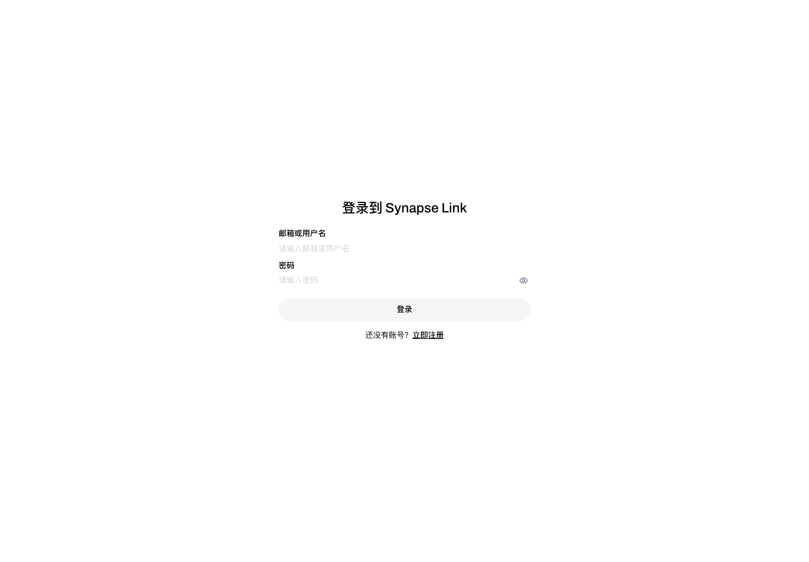
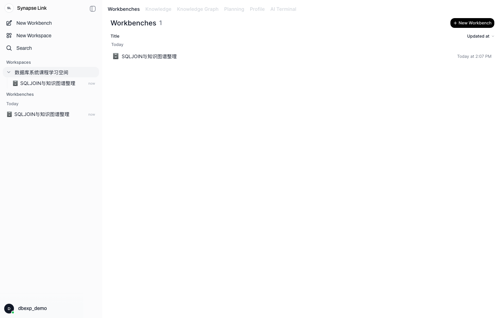
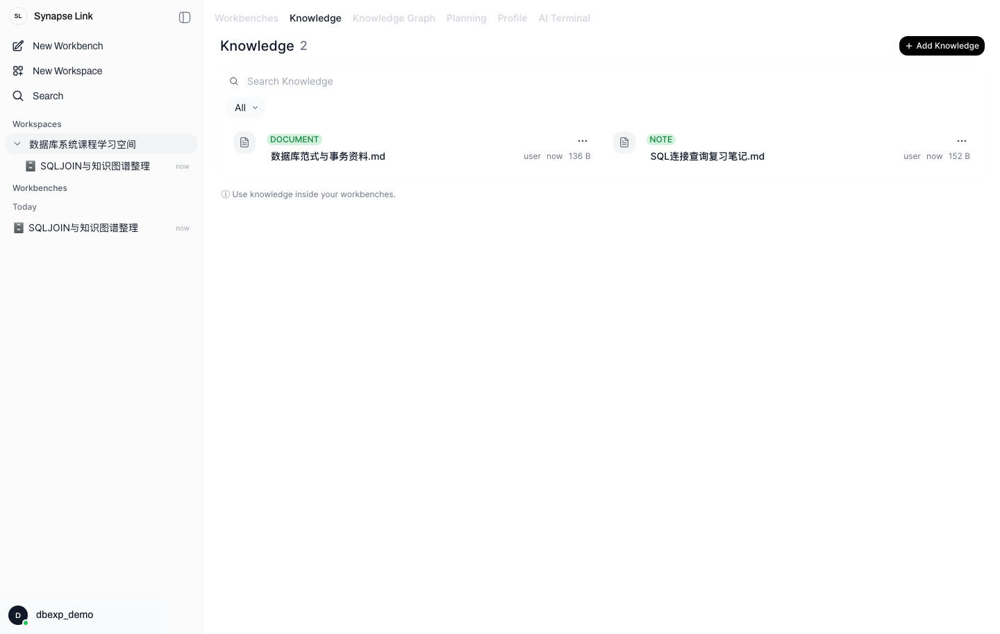
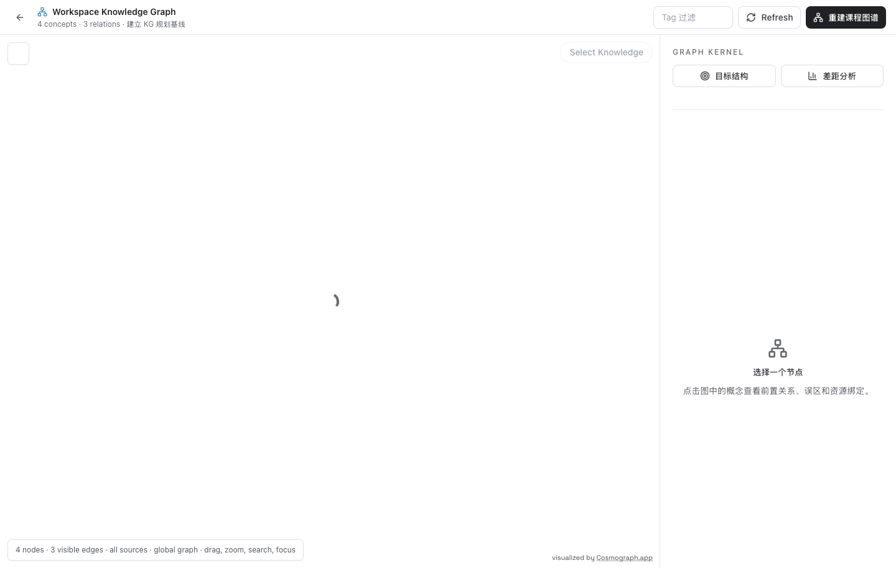
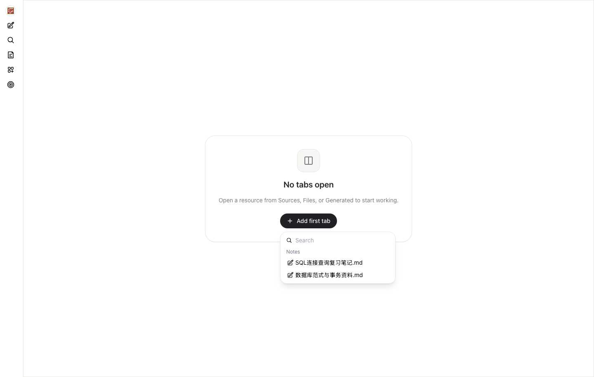
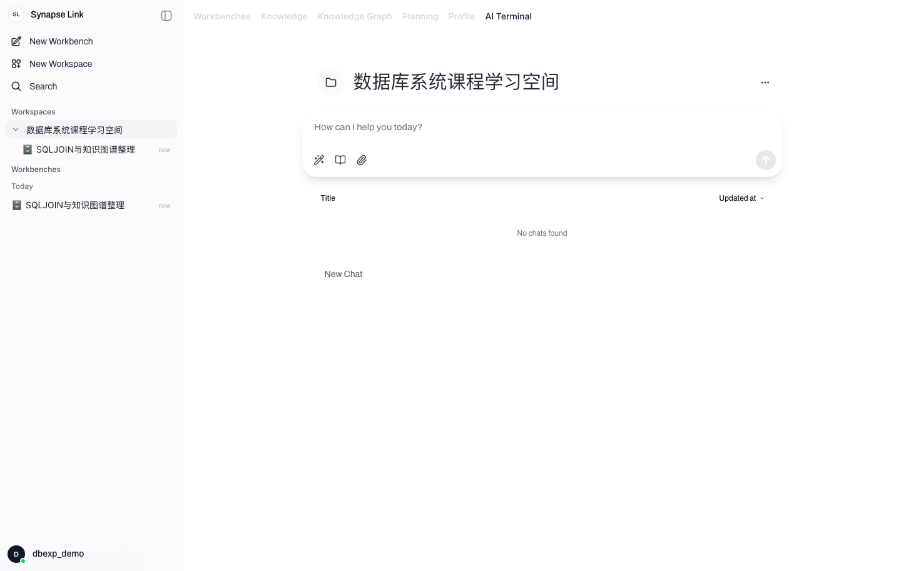
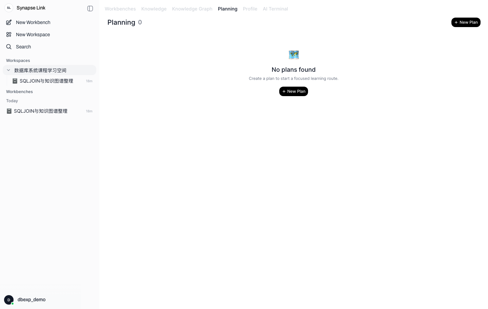
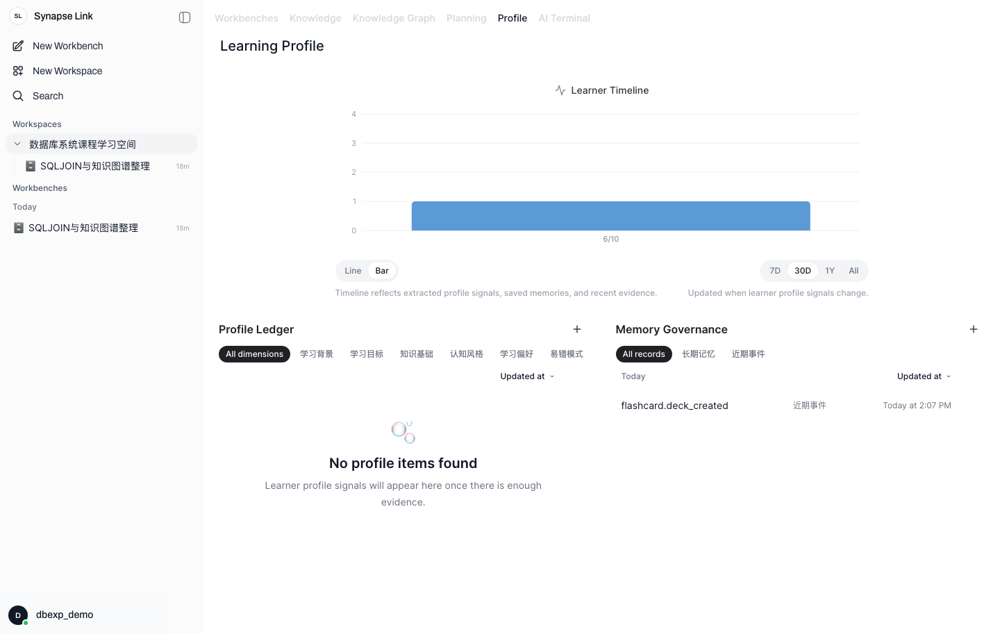

# 系统功能说明（截图对应版）

本文档结合《AI Learning Workspace 系统功能说明书》和本次数据库实验截图，对“大学生智能学习辅助平台”的主要功能进行说明。截图来自本地运行的软件原型，演示数据为“数据库系统课程学习空间”，用于展示系统原型已经具备账号登录、课程空间管理、学习资料管理、学习现场管理、知识图谱、AI 对话、学习计划和学习画像等功能。

## 1. 系统功能概述

AI Learning Workspace 是一个面向大学生自主学习的智能学习工作空间。系统以“课程空间 Workspace”为长期学习容器，以“学习现场 Workbench”为具体任务工作台，将课程资料、学习笔记、知识图谱、AI Terminal、学习计划、闪卡复习和学习画像整合在同一平台中。

本次数据库实验选取的核心功能包括：

| 功能模块 | 功能说明 | 对应截图 |
| --- | --- | --- |
| 账号与登录 | 用户登录、注册、会话保持和访问保护 | 图 1 |
| 课程空间管理 | 创建和查看课程空间，组织课程级学习数据 | 图 2 |
| 学习现场管理 | 创建和查看具体学习任务 | 图 3 |
| 课程资料管理 | 管理课程文档、笔记、资料和生成内容 | 图 4 |
| 课程知识图谱 | 展示知识概念和概念之间的关系 | 图 5 |
| Workbench 学习现场 | 在任务工作台中打开和组织学习资料 | 图 6 |
| AI Terminal | 进行课程级 AI 对话和智能学习辅助 | 图 7 |
| 学习计划 | 管理围绕目标生成的学习计划 | 图 8 |
| 学习画像与学习事件 | 展示学习行为、记忆和画像信号 | 图 9 |

## 2. 账号登录与访问保护

图 1 为系统登录界面。用户可以使用邮箱或用户名登录系统，也可以切换到注册模式创建账号。用户登录成功后，系统进入课程空间页面；未登录用户访问课程空间、学习现场等核心页面时会被拦截。

该模块对应系统功能说明书中的“账号与安全模块”。其主要功能包括用户注册、用户登录、获取当前用户、退出登录和会话保持。后端通过认证中间件校验用户身份，前端通过受保护路由限制未登录访问。

数据库设计中，该功能主要对应 `Users` 表。用户登录后创建的课程空间、学习现场、对话记录和学习事件都归属于当前用户，从而实现不同用户之间的数据隔离。

## 3. 课程空间管理

图 2 为课程空间主页。左侧显示系统导航、课程空间列表和当前课程下的学习现场列表；右侧显示当前课程空间的主要内容。截图中的演示课程为“数据库系统课程学习空间”，用于组织数据库课程复习资料、学习任务和知识图谱。

课程空间是系统的数据边界和学习上下文边界。一个用户可以创建多个课程空间，例如“数据库系统”“数据结构”“机器学习”等。每个课程空间下可以继续管理资料、学习现场、学习计划、知识图谱、AI 对话和学习画像。

数据库设计中，该模块主要对应 `Workspaces` 表，并与 `Users` 表形成一对多关系：一个用户可以拥有多个课程空间，一个课程空间只能属于一个用户。

## 4. 学习现场管理

图 3 为课程空间中的学习现场管理界面。学习现场用于承载具体学习任务，例如“SQL JOIN 与知识图谱复习”。用户可以在课程空间中查看已有学习现场，也可以通过页面右上角按钮新建学习现场。

学习现场是系统从“课程级管理”进入“任务级学习”的关键对象。一个课程空间可以包含多个学习现场，每个学习现场可以绑定资料、保存工作台状态、关联学习计划，并承载 AI 辅助学习过程。

数据库设计中，该模块主要对应 `Workbenches` 表。`Workbenches` 通过 `workspace_id` 关联到 `Workspaces`，形成一个课程空间包含多个学习现场的关系。

## 5. 课程资料管理

图 4 为课程资料管理界面。系统在 Knowledge 标签页中展示课程资料，支持按名称搜索、按类型筛选、查看资料类型、来源、大小和更新时间。截图中包含“数据库范式与事务资料.md”和“SQL 连接查询复习笔记.md”两份课程资料。

课程资料管理模块用于保存用户上传或创建的学习资料。资料可以是 PDF、Markdown、课堂笔记、网页来源、代码文件、AI 生成内容等。资料进入系统后，可以进一步用于知识切块、知识图谱抽取、AI 问答和 Workbench 学习现场。

数据库设计中，该模块主要对应 `FileObjects` 表。资料与学习现场之间通过 `WorkbenchResources` 表形成多对多关系，使同一份课程资料可以被多个学习任务复用。

## 6. 课程知识图谱

图 5 为课程知识图谱界面。页面顶部显示当前图谱包含 4 个知识概念和 3 条概念关系。系统可以用图结构表示课程中的知识点，例如“关系模型”“SQL 连接查询”“数据库范式”“事务 ACID”，并记录它们之间的先修、相关或包含关系。

知识图谱模块用于帮助学生理解课程知识结构。用户可以通过图谱查看概念之间的联系，进一步分析先修路径、薄弱知识点和补救学习方向。右侧图谱分析区域用于展示选中概念的详情、目标结构和差距分析。

数据库设计中，该模块主要对应：

| 数据表 | 作用 |
| --- | --- |
| `KnowledgeConcepts` | 保存课程知识概念 |
| `KnowledgeRelations` | 保存概念之间的先修、相关、包含等关系 |
| `KnowledgeBindings` | 保存概念与资料、学习现场、学习目标之间的绑定关系 |
| `KnowledgeChunks` | 保存从课程资料中切分得到的知识片段 |

## 7. Workbench 学习现场

图 6 为 Workbench 学习现场界面。用户进入学习现场后，可以打开课程资料、笔记或 AI 生成资源作为工作台标签页。截图中点击 “Add first tab” 后，系统显示当前学习现场可打开的资料列表，包括 SQL 复习笔记和数据库范式资料。

Workbench 用于把学习资料、笔记、代码、AI 助手和生成资源集中到一个任务环境中。与课程空间相比，Workbench 更强调具体学习任务的执行过程，例如一次 SQL 复习、一份课程报告整理或一个项目实践任务。

数据库设计中，该模块主要对应 `Workbenches`、`FileObjects` 和 `WorkbenchResources` 表。其中 `WorkbenchResources` 是中间表，用于记录某个学习现场绑定了哪些资料、资料在学习现场中的角色以及显示顺序。

## 8. AI Terminal 智能学习入口

图 7 为 AI Terminal 界面。AI Terminal 是课程级智能助手入口，用户可以输入自然语言问题，例如请求总结资料、生成复习计划、解释知识点或创建学习现场。该模块体现了系统的 AI 原生学习工作台特征。

AI Terminal 支持课程级上下文。系统可以结合当前课程空间、用户选择的资料、已有学习目标、学习事件和知识图谱，为用户提供更贴近课程内容的回答和建议。

数据库设计中，该模块主要对应：

| 数据表 | 作用 |
| --- | --- |
| `ConversationSessions` | 保存 AI 对话会话 |
| `ConversationMessages` | 保存每轮用户消息和 AI 回复 |
| `LearningEvents` | 记录 AI 交互产生的重要学习行为 |
| `FileObjects`、`KnowledgeChunks` | 为 AI 问答提供资料和知识片段上下文 |

## 9. 学习计划管理

图 8 为学习计划管理界面。用户可以在 Planning 标签页中新建学习计划，围绕某个学习目标生成阶段任务、复习步骤和后续行动。截图展示了学习计划入口和新建计划按钮。

学习计划模块用于将用户的自然语言目标转化为可执行的学习路径。例如用户可以提出“复习数据库考试中的 SQL 和事务”，系统可以围绕目标拆解阶段、安排资料阅读、练习和复盘。

数据库设计中，该模块主要对应 `LearningGoals` 和 `LearningPlans` 表。`LearningGoals` 保存学习目标，`LearningPlans` 保存计划内容、状态、版本和关联的学习现场。

## 10. 学习画像与学习事件

图 9 为学习画像界面。页面上方的 Learner Timeline 用于展示学习行为和画像信号变化；下方包括 Profile Ledger 和 Memory Governance。截图中可以看到近期事件 `flashcard.deck_created`，说明系统已经记录了闪卡卡组创建行为。

学习画像模块用于把用户的学习行为转化为可解释的数据证据。系统可以记录资料上传、学习计划创建、AI 对话、闪卡生成、闪卡复习等事件，并基于这些事件分析用户的学习状态、偏好和薄弱点。

数据库设计中，该模块主要对应 `LearningEvents` 表。若进一步扩展，也可以结合 `SavedMemory`、闪卡相关表和学习画像相关表，实现长期记忆、偏好管理和学习状态分析。

## 11. 功能、截图与数据库表对应关系

| 序号 | 系统功能 | 截图 | 主要操作 | 主要数据库表 |
| --- | --- | --- | --- | --- |
| 1 | 用户登录 | 图 1 | 登录、注册、保持会话 | `Users` |
| 2 | 课程空间管理 | 图 2 | 查看课程空间、新建课程空间、切换课程 | `Workspaces`、`Users` |
| 3 | 学习现场管理 | 图 3 | 查看学习现场、新建学习现场 | `Workbenches`、`Workspaces` |
| 4 | 课程资料管理 | 图 4 | 查看资料、搜索资料、管理资料 | `FileObjects` |
| 5 | 课程知识图谱 | 图 5 | 查看知识概念和概念关系 | `KnowledgeConcepts`、`KnowledgeRelations` |
| 6 | 学习现场工作台 | 图 6 | 打开资料、绑定资源到学习现场 | `WorkbenchResources`、`FileObjects` |
| 7 | AI Terminal | 图 7 | AI 对话、资料问答、计划生成 | `ConversationSessions`、`ConversationMessages` |
| 8 | 学习计划管理 | 图 8 | 新建计划、查看计划入口 | `LearningGoals`、`LearningPlans` |
| 9 | 学习画像与事件 | 图 9 | 查看学习事件、画像和记忆治理 | `LearningEvents` |

## 12. 小结

通过以上截图可以看出，系统已经具备数据库设计实验要求中的基本系统原型能力。用户可以完成登录、创建课程空间、管理课程资料、创建学习现场、查看知识图谱、进入 AI Terminal、管理学习计划并查看学习画像。上述界面与前文数据库设计中的核心实体相互对应，能够说明数据库表结构不仅是静态设计，也支撑了实际软件中的主要业务流程。

